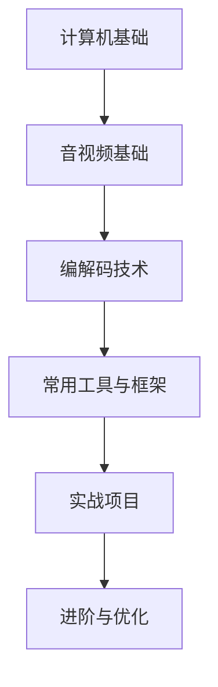

<h1 align="center">🎬 音视频开发学习 </h1>

<p align="center">
  🌟 本仓库旨在为学习 音视频开发 的程序员们提供一个清晰的认知
</p>

<p align="center">
  💡 涵盖从基础知识到实战项目的资料与示例，帮助你快速入门并逐步进阶  
</p>


---

## 📑 目录
- [📌 仓库目标](#-仓库目标)
- [🌟 学习路线](#-学习路线)
- [📚 学习资料](#-学习资料)
  - [书籍](#-书籍)
  - [文章](#-文章)
  - [开源框架](#-开源框架)
  - [视频学习](#视频学习)
  - [paper](#-paper)
  - [流媒体](#流媒体)
  - [协议](#-协议)
  - [实践项目](#-实践项目)
  - [面试题](#面试题)
- [📖 学习阶段](#-学习阶段)
  - [计算机基础知识](#计算机基础知识)
    - [C/C++ 基础](#1-cc-基础与编程范式)
    - [数据结构与算法](#2-数据结构与算法)
    - [操作系统与多线程](#3-操作系统与多线程)
    - [计算机网络](#4-计算机网络)
  - [音视频基础](#音视频基础)
    - [基础理论](#00-基础理论音视频处理的基石)
    - [压缩与编码](#01-压缩与编码掌握数据变小的秘密)
    - [流媒体协议](#02-流媒体协议数据在网络上的传输方式)
    - [ffmpeg 大全](##03-ffmpeg-大全-ffmpeg-toolkit)
    - [播放器开发](#04-播放器开发从零开始的实战之旅)
    - [采集与推流](#05-采集与推流数据从源头到网络的旅程)
    - [webrtc 低延迟](#06-webrtc-低延迟开启实时音视频通信)
    - [音视频处理进阶](#07-音视频处理进阶提升视听体验的魔法)
    - [性能优化与调试](#08-性能优化与调试解决卡顿延迟与花屏)
---

## 📌 仓库目标
- 系统整理音视频开发的 **学习路线**  
- 提供 **基础知识 + 工具框架 + 实战项目** 的学习参考  
- 收录 **学习资料、书籍、开源项目**，避免信息碎片化  

---

## 🌟 学习路线


---

## 📚 学习资料

### 📙 书籍

No.|book nam|author
:------- | :--------------- | :------------
1|FFmpeg从入门到精通|刘歧, 赵文杰
2|视频图像处理与性能优化|梁军, 贾海鹏
3|数字图像与视频处理|卢官明, 唐贵进, 崔子冠
4|数字音视频技术及应用|陈光军
5|音视频开发进阶指南：基于Android与iOS平台的实践|展晓凯, 魏晓红
6|视频编码全角度详解：AVS_China、H.264_MPEG-4_PART10、HEVC、VP6、DIRAC、VC-1|刘歧, 赵文杰
7|FFMPEG - From Zero to Hero|Nick, Ferrando|
8|FFmpeg Basics 2012|Frantisek Korbel|
9|Handbook on SDP for Multimedia Session Negotiations SIP and WebRTC IP Telephony |Roy, Radhika Ranjan|
10|Learning WebRTC|Dan Ristic|
11|Real-Time Communication with WebRTC |Salvatore Loreto, Simon Pietro Romano|


### 📰 文章

No.|article
:------- | :--------------- 
1|[WebRTC 发送方码率预估实现解析](https://github.com/0voice/awesome_audio_video_learning/blob/main/article/001-WebRTC%20发送方码率预估实现解析.md)
2|[码率控制基本概念](https://github.com/0voice/awesome_audio_video_learning/blob/main/article/002-码率控制基本概念.md)
3|[Speex回声消除代码分析](https://github.com/0voice/awesome_audio_video_learning/blob/main/article/003-Speex回声消除代码分析.md)
4|[房间声学原理与Schroeder混响算法实现](https://github.com/0voice/awesome_audio_video_learning/blob/main/article/004-房间声学原理与Schroeder混响算法实现.md)
5|[H264系列--压缩编码技术](https://github.com/0voice/awesome_audio_video_learning/blob/main/article/005-H264系列--压缩编码技术.md)
6|[RTSP 媒体协议流的录制方案及其覆盖策略详解](https://github.com/0voice/awesome_audio_video_learning/blob/main/article/006-RTSP%20媒体协议流的录制方案及其覆盖策略详解.md)
7|[建立连接之ICE框架](https://github.com/0voice/awesome_audio_video_learning/blob/main/article/007-webrtc建立连接之ICE框架.md)
8|[流媒体协议介绍（rtp/rtcp/rtsp/rtmp/mms/hls）](https://github.com/0voice/awesome_audio_video_learning/blob/main/article/008-流媒体协议介绍.md)
9|[音视频同步原理及实现](https://github.com/0voice/awesome_audio_video_learning/blob/main/article/009-音视频同步原理及实现.md)
10|[直播概念和流程框架](https://github.com/0voice/awesome_audio_video_learning/blob/main/article/010-直播概念和流程框架.md)
11|[CDN在直播中的运用](https://github.com/0voice/awesome_audio_video_learning/blob/main/article/011-CDN在直播中的运用.md)
12|[常见音视频编码格式](https://github.com/0voice/awesome_audio_video_learning/blob/main/article/012-常见音视频编码格式.md)
13|[H.264官方软件JM源代码分析-编码器lencod](https://github.com/0voice/awesome_audio_video_learning/blob/main/article/013-H.264官方软件JM源代码分析-编码器lencod.md)
14|[H.264官方软件JM源代码分析-解码器ldecod](https://github.com/0voice/awesome_audio_video_learning/blob/main/article/014-H.264官方软件JM源代码分析-解码器ldecod.md)
15|[Android 音视频技术](https://github.com/0voice/awesome_audio_video_learning/blob/main/article/015-Android%20音视频技术.md)
16|[Web前端WebRTC攻略-媒体协商与SDP简析](https://github.com/0voice/awesome_audio_video_learning/blob/main/article/016-Web前端WebRTC攻略-媒体协商与SDP简析.md)
17|[基于FFmpeg的AVfilter的例子-纯净版](https://github.com/0voice/awesome_audio_video_learning/blob/main/article/017-基于FFmpeg的AVfilter的例子-纯净版.md)
18|[WebRTC 传输安全机制第二话：深入显出 SRTP 协议](https://github.com/0voice/awesome_audio_video_learning/blob/main/article/018-WebRTC%20传输安全机制第二话：深入显出%20SRTP%20协议.md)
19|[WebRTC能给我带来什么？](https://github.com/0voice/awesome_audio_video_learning/blob/main/article/019-WebRTC能给我带来什么？.md)
20|[视音频数据处理：RGB、YUV像素数据处理](https://github.com/0voice/awesome_audio_video_learning/blob/main/article/020-视音频数据处理：RGB、YUV像素数据处理.md)
21|[视音频数据处理：PCM音频采样数据处理](https://github.com/0voice/awesome_audio_video_learning/blob/main/article/021-视音频数据处理：PCM音频采样数据处理.md)
22|[视音频数据处理：H.264视频码流解析](https://github.com/0voice/awesome_audio_video_learning/blob/main/article/022-视音频数据处理：H.264视频码流解析.md)
23|[视音频数据处理：AAC音频码流解析](https://github.com/0voice/awesome_audio_video_learning/blob/main/article/023-视音频数据处理：AAC音频码流解析.md)
24|[视音频数据处理：FLV封装格式解析](https://github.com/0voice/awesome_audio_video_learning/blob/main/article/024-视音频数据处理：FLV封装格式解析.md)
25|[视音频数据处理：UDP-RTP协议解析](https://github.com/0voice/awesome_audio_video_learning/blob/main/article/025-视音频数据处理：UDP-RTP协议解析.md)
26|[如何生成mp4文件](https://github.com/0voice/awesome_audio_video_learning/blob/main/article/026-如何生成mp4文件.md)
27|[ffmpeg滤镜的基本使用](https://github.com/0voice/awesome_audio_video_learning/blob/main/article/027-ffmpeg滤镜的基本使用.md)
28|[webRTC是如何实现音视频的录制](https://github.com/0voice/awesome_audio_video_learning/blob/main/article/028-webRTC是如何实现音视频的录制.md)
29|[音视频同步算法](https://github.com/0voice/awesome_audio_video_learning/blob/main/article/029-音视频同步算法.md)
30|[房间声学原理与Schroeder混响算法实现](https://github.com/0voice/awesome_audio_video_learning/blob/main/article/030-房间声学原理与Schroeder混响算法实现.md)
31|[一个频域语音降噪算法实现及改进方法](https://github.com/0voice/awesome_audio_video_learning/blob/main/article/031-一个频域语音降噪算法实现及改进方法.md)
32|[HEVC官方软件HM源代码分析-编码器TAppEncoder](https://github.com/0voice/awesome_audio_video_learning/blob/main/article/032-HEVC官方软件HM源代码分析-编码器TAppEncoder.md)
33|[HEVC官方软件HM源代码分析-解码器TAppDecoder](https://github.com/0voice/awesome_audio_video_learning/blob/main/article/033-HEVC官方软件HM源代码分析-解码器TAppDecoder.md)
34|[音视频编解码常用知识点](https://github.com/0voice/awesome_audio_video_learning/blob/main/article/034-音视频编解码常用知识点.md)
35|[微信小程序集成实时音视频通话功能](https://github.com/0voice/awesome_audio_video_learning/blob/main/article/035-微信小程序集成实时音视频通话功能.md)
36|[视音频编解码技术零基础学习方法](https://github.com/0voice/awesome_audio_video_learning/blob/main/article/036-视音频编解码技术零基础学习方法.md)
37|[RTSP协议学习](https://github.com/0voice/awesome_audio_video_learning/blob/main/article/037-RTSP协议学习.md)
38|[HEVC码流分析](https://github.com/0voice/awesome_audio_video_learning/blob/main/article/038-HEVC码流分析.md)
39|[H.264简单码流分析](https://github.com/0voice/awesome_audio_video_learning/blob/main/article/039-H.264简单码流分析.md)
40|[MPEG2简单码流分析](https://github.com/0voice/awesome_audio_video_learning/blob/main/article/040-MPEG2简单码流分析.md)
41|[视频码流分析工具](https://github.com/0voice/awesome_audio_video_learning/blob/main/article/041-视频码流分析工具.md)
42|[H.264分析器](https://github.com/0voice/awesome_audio_video_learning/blob/main/article/042-H.264分析器.md)
43|[FFmpeg架构之IO模块分析](https://github.com/0voice/awesome_audio_video_learning/blob/main/article/043-FFmpeg架构之IO模块分析.md)
44|[(Video and Audio Data Processing)UDP-RTP协议解析](https://github.com/0voice/awesome_audio_video_learning/blob/main/article/044-[Video%20and%20Audio%20Data%20Processing]%20UDP-RTP协议解析.md)
45|[RTSP协议实例分析](https://github.com/0voice/awesome_audio_video_learning/blob/main/article/045-RTSP协议实例分析.md)
46|[RTSP协议之TCP或UDP问题](https://github.com/0voice/awesome_audio_video_learning/blob/main/article/046-RTSP协议之TCP或UDP问题.md)
47|[ffplay工具命令使用技巧](https://github.com/0voice/awesome_audio_video_learning/blob/main/article/047-ffplay工具命令使用技巧.md)
48|[VLC RTSP网络串流播放失败](https://github.com/0voice/awesome_audio_video_learning/blob/main/article/048-VLC%20RTSP网络串流播放失败.md)
49|[RTMP协议详解](https://github.com/0voice/awesome_audio_video_learning/blob/main/article/049-RTMP协议详解.md)
50|[STUN 原理理解](https://github.com/0voice/awesome_audio_video_learning/blob/main/article/050-STUN%20原理理解.md)

### 🌐 开源框架

**实时音视频开源项目**

实时音视频应用共包括几个环节：采集、编码、前后处理、传输、解码、缓冲、渲染等很多环节。每一个细分环节，还有更细分的技术模块。  

比如，前后处理环节有美颜、滤镜、回声消除、噪声抑制等，采集有麦克风阵列等，编解码有VP8、VP9、H.264、H.265等。

#### 编解码开源项目
  
project|website|introduce
:------- | :--------------- | :------------
WebRTC|[webrtc.org](https://www.webrtc.org)|WebRTC实现了基于网页的视频会议，标准是WHATWG 协议，目的是通过浏览器提供简单的javascript就可以达到实时通讯（Real-Time Communications (RTC)）能力。WebRTC提供了视频会议的核心技术，包括音视频的采集、编解码、网络传输、显示等功能，并且还支持跨平台：windows，linux，mac，android。
x264|[www.linuxfromscratch.org](https://www.linuxfromscratch.org)|H.264是ITU（International Telecommunication Union，国际通信联盟）和MPEG（Motion Picture Experts Group，运动图像专家组）联合制定的视频编码标准。而x264是一个开源的H.264/MPEG-4 AVC视频编码函数库，是最好的有损视频编码器之一。
FFmpeg|[ffmpeg.org](https://www.ffmpeg.org)|FFmpeg是一套可以用来记录、转换数字音频、视频，并能将其转化为流的开源计算机程序。采用LGPL或GPL许可证。它提供了录制、转换以及流化音视频的完整解决方案。FFmpeg提供了编码、解码、转换、封装等功能，以及剪裁、缩放、色域等后期处理。
ijkplayer|[bilibili/ijkplayer](https://github.com/bilibili/ijkplayer)|ijkplayer 是一个基于 ffplay 的轻量级 Android/iOS 视频播放器。实现了跨平台功能，API易于集成；编译配置可裁剪，方便控制安装包大小；支持硬件加速解码，更加省电；提供Android平台下应用弹幕集成的解决方案。
JSMpeg|[jsmpeg.com](https://jsmpeg.com)|JSMpeg is a Video Player written in JavaScript. It consists of an MPEG-TS Demuxer, WebAssembly MPEG1 Video & MP2 Audio Decoders, WebGL & Canvas2D Renderers and WebAudio Sound Output. JSMpeg can load static files via Ajax and allows low latency streaming (~50ms) via WebSocktes.
Opus|[opus.nlpl.eu](https://opus.nlpl.eu)|Opus是一个有损声音编码的格式，由Xiph.Org基金会开发，之后由IETF（互联网工程任务组）进行标准化，目标是希望用单一格式包含声音和语音，取代Speex和Vorbis，且适用于网络上低延迟的即时声音传输，标准格式定义于RFC 6716文件。Opus格式是一个开放格式，使用上没有任何专利或限制。
live555|[www.live555.com](http://www.live555.com)|live555是一个为流媒体提供解决方案的跨平台的C++开源项目，它实现了标准流媒体传输，是一个为流媒体提供解决方案的跨平台的C++开源项目，它实现了对标准流媒体传输协议如RTP/RTCP、RTSP、SIP等的支持。Live555实现了对多种音视频编码格式的音视频数据的流化、接收和处理等支持，包括MPEG、H.263+ 、DV、JPEG视频和多种音频编码。


#### 服务端开源项目

project|website|introduce
:------- | :--------------- | :------------
jitsi|[jitsi/jitsi](https://github.com/jitsi/jitsi)|Jitsi is an audio/video and chat communicator that supports protocols such as SIP, XMPP/Jabber, IRC and many other useful features.
JsSIP|[jssip.net](https://jssip.net)|JsSIP是一个简单易用的JavaScript库，它利用SIP和WebRTC的最新发展，在任何网站上提供全功能的SIP端点。通过JsSIP ，只要几行代码，任何网站都可以通过音频，视频等获得实时通信功能。
SRS|[www.ossrs.net](http://www.ossrs.net)|SRS定位是运营级的互联网直播服务器集群，追求更好的概念完整性和最简单实现的代码。SRS提供了丰富的接入方案将RTMP流接入SRS，包括推送RTMP到SRS、推送RTSP/UDP/FLV到SRS、拉取流到SRS。SRS还支持将接入的RTMP流进行各种变换，譬如将RTMP流转码、流截图、转发给其他服务器、转封装成HTTP-FLV流、转封装成HLS、转封装成HDS、录制成FLV。SRS包含支大规模集群如CDN业务的关键特性，譬如RTMP多级集群、源站集群、VHOST虚拟服务器、无中断服务Reload、HTTP-FLV集群、Kafka对接。此外，SRS还提供丰富的应用接口，包括HTTP回调、安全策略Security、HTTP API接口、RTMP测速。
JRTPLIB|[j0r1/JRTPLIB](https://github.com/j0r1/JRTPLIB)|jrtplib是一个基于C++、面向对象的RTP封装库, jrtplib支持定义于RFC3550中的RTP协议，它使得发送和接收RTP报文变得异常简单，用户不用担心SSRC冲突，也不用考虑如何传输RTCP数据，因为RTCP功能完全在内部实现。
OPAL|[opalvoip](http://sourceforge.net/projects/opalvoip/files/)|Open Phone Abstraction Library (OPAL) is a C++ multi-platform, multi-protocol library for Fax, Video & Voice over IP and other networks. Also included is the Portable Tool Library (PTLib) which is a C++ multi-platform abstraction library.
Kurento|[www.kurento.org](http://www.kurento.org)|Kurento 是一个WebRTC流媒体服务器以及一些客户端API，开发WWW及智能手机平台的高级视频应用就变得更加容易。可以利用Kurento开发的应用类型包括，视频会议，音视频广播，音视频录制、转码等。
Janus|[janus.conf.meetecho.com](https://janus.conf.meetecho.com)|Janus 是由Meetecho设计和开发的开源、通用的基于SFU架构的WebRTC流媒体服务器，它支持在Linux的服务器或MacOS上的机器进行编译和安装。

#### 质量传输开源项目

project|website|introduce
:------- | :--------------- | :------------
callstats.io|[callstats](https://www.callstats.io)|Callstats.io致力于监控和管理WebRTC应用中的音频和视频通话性能。提供Javascript客户端库，可以监测浏览器终端性能，从而帮助服务供应商准确定位那些媒体质量较低的终端用户，并进行性能问题的诊断。该信息主要是用于产品经理和工程师来提高客户体验质量，主动解决潜在的瓶颈障碍。
Meetecho|[meetecho/janus-gateway](https://github.com/meetecho/janus-gateway)|Meetecho Janus是Meetecho公司的一款WebRTC（网页即时通信）服务器。
Agora|[agora.io](https://www.agora.io/cn)|声网Agora提供了一套简单而强大的SDK,开发者可以利用其中的资源在任何手机或电脑应用中加入高清语音和视频通讯功能。

#### 视频前后处理开源项目

##### 音频

project|website|introduce
:------- | :--------------- | :------------
soundtouch|[soundtouch](https://gitlab.com/soundtouch/soundtouch)|SoundTouch是一个开源的音频处理库，主要实现包含变速、变调、变速同时变调等三个 功能模块，能够对媒体流实时操作，也能对音频文件操作。采用32位浮点或者16位定点，支持单声道或者双声道，采样率范围为8k~48k。

##### 视频

project|website|introduce
:------- | :--------------- | :------------
SeetaFace6|[SeetaFace6Open](https://github.com/SeetaFace6Open/index)|SeetaFace6是中科视拓最新开源的商业正式版本。包含人脸识别的基本部分，如人脸检测、关键点定位、人脸识别。同时增加了活体检测、质量评估、年龄性别估计。并且响应时事，开放了口罩检测以及戴口罩的人脸识别模型。
GPUImage2|[GPUImage2](https://github.com/BradLarson/GPUImage2)|GPUImage是个功能十分强大、又十分易用的图像处理库。提供各种各样的图像处理滤镜，并且支持照相机和摄像机的实时滤镜。
open nsfw|[open_nsfw](https://github.com/yahoo/open_nsfw)|open nsfw是雅虎开源项目caffeonspark，使用深度学习训练得到caffe模型。nsfw翻译为不可在工作中看的图片。主要是针对黄图的，恐怖，血腥图片不能识别。
PaddleGAN|[PaddleGAN](https://github.com/PaddlePaddle/PaddleGAN)|PaddleGAN是百度飞桨团队开源的对抗网络工具箱，提供了视频超分、插帧、上色等高质量深度学习能力。

#### 其他音视频开源项目
  
project|website|introduce
:------- | :--------------- | :------------ 
Speex|[xiph.org](https://www.xiph.org)|Speex是一套主要针对语音的开源免费，无专利保护的音频压缩格式。
FLAC|[xiph.org](https://www.xiph.org)|FLAC中文可解释为无损音频压缩编码。FLAC是一套著名的自由音频压缩编码，其特点是无损压缩。不同于其他有损压缩编码如MP3及AAC，它不会破坏任何原有的音频信息，所以可以还原音乐光盘音质。
Xvid|[xvidmovies](https://www.xvidmovies.com/players/)|Xvid是一个开放源代码的MPEG-4视频编解码器，它是基于OpenDivX而编写的。
Lagarith|[lags.leetcode.net](https://lags.leetcode.net/index.htm)|Lagarith，是一种由Ben Greenwood所撰写的影片编解码器（video codec）。
Thor|[wwww.thor.com](https://www.thor.com)|Thor是思科开源的视频编码解码器，Thor拥有适当复杂度的高压缩率视频编码解码器，使用众所周知的 motion-compensated 预测的混合视频编码方法和变换编码。

### 视频学习

#### 国外大神

No.|title
:------- | :---------------
1|[如何使用FFMPEG将MP4视频文件转换为GIF](https://www.0voice.com/uiwebsite/audio_video_streaming/video/001-如何使用FFMPEG将MP4视频文件转换为GIF.mp4)
2|[FFMPEG Introduction & Examples](https://www.0voice.com/uiwebsite/audio_video_streaming/video/002-FFMPEG%20Introduction%20%26%20Examples.mp4)
3|[Live Streaming with Nginx and FFmpeg](https://www.0voice.com/uiwebsite/audio_video_streaming/video/003-Live%20Streaming%20with%20Nginx%20and%20FFmpeg.mp4)
4|[Ep2 Ffmpeg Nginx & Nginx-Rtmp-Module Streaming to Server](https://www.0voice.com/uiwebsite/audio_video_streaming/video/004-Ep2%20Ffmpeg%20Nginx%20%26%20Nginx-Rtmp-Module%20Streaming%20to%20Server.mp4)
5|[Streaming an IP Camera to a Web Browser using FFmpeg](https://www.0voice.com/uiwebsite/audio_video_streaming/video/005-Streaming%20an%20IP%20Camera%20to%20a%20Web%20Browser%20using%20FFmpeg.mp4)
6|[Easy Screencasting and Webcamming with ffmpeg in Linux](https://www.0voice.com/uiwebsite/audio_video_streaming/video/006-Easy%20Screencasting%20and%20Webcamming%20with%20ffmpeg%20in%20Linux.mp4)
7|[Streaming an IP Camera to a Web Browser using FFmpeg](https://www.0voice.com/uiwebsite/audio_video_streaming/video/007-Streaming%20an%20IP%20Camera%20to%20a%20Web%20Browser%20using%20FFmpeg.mp4)
8|[FFMPEG Advanced Techniques Pt2 - Filtergraphs & Timeline](https://www.0voice.com/uiwebsite/audio_video_streaming/video/008-FFMPEG%20Advanced%20Techniques%20Pt2%20-%20Filtergraphs%20%26%20Timeline.mp4)
9|[Convert HEVCh265 mkv video to AVCh264 mp4 with ffmpeg](https://www.0voice.com/uiwebsite/audio_video_streaming/video/009-Convert%20HEVCh265%20mkv%20video%20to%20AVCh264%20mp4%20with%20ffmpeg.mp4)
10|[How to add soft subtitles( srt subrip) to mp4 video using ffmpeg](https://www.0voice.com/uiwebsite/audio_video_streaming/video/010-How%20to%20add%20soft%20subtitles(%20srt%20subrip)%20to%20mp4%20video%20using%20ffmpeg.mp4)
11|[FFmpeg Processing multiple video files by using.bat file](https://www.0voice.com/uiwebsite/audio_video_streaming/video/011-FFmpeg%20Processing%20multiple%20video%20files%20by%20using.bat%20file.mp4)
12|[Opensource Multimedia Framework -- FFmpeg](https://www.0voice.com/uiwebsite/audio_video_streaming/video/012-Opensource%20Multimedia%20Framework%20--%20FFmpeg.mp4)
13|[rtsp streaming node js ip camera jsmpeg](https://www.0voice.com/uiwebsite/audio_video_streaming/video/013-rtsp%20streaming%20node%20js%20ip%20camera%20jsmpeg.mp4)
14|[H.265 RTSP Streaming to VLC + NewTek NDI Integration](https://www.0voice.com/uiwebsite/audio_video_streaming/video/014-H.265%20RTSP%20Streaming%20to%20VLC%20+%20NewTek%20NDI%20Integration.mp4)
15|[IP camera stream using RTSP and openCV python](https://www.0voice.com/uiwebsite/audio_video_streaming/video/015-IP%20camera%20stream%20using%20RTSP%20and%20openCV%20python.mp4)
16|[NAT Traversal & RTSP](https://www.0voice.com/uiwebsite/audio_video_streaming/video/016-NAT%20Traversal%20%26%20RTSP.mp4)
17|[Simple client et serveur de Streaming RTSP MJPEG(JAVA SE)](https://www.0voice.com/uiwebsite/audio_video_streaming/video/017-Simple%20client%20et%20serveur%20de%20Streaming%20RTSP%20MJPEG(JAVA%20SE).mp4)
18|[Build Your First WebRTC Video Chat App](https://www.0voice.com/uiwebsite/audio_video_streaming/video/018-Build%20Your%20First%20WebRTC%20Video%20Chat%20App.mp4)
19|[P2P Video Chat with JavaScript/WebRTC](https://www.0voice.com/uiwebsite/audio_video_streaming/video/019-P2P%20Video%20Chat%20with%20JavaScript%20WebRTC.mp4)
20|[Building a WebRTC app - LIVE](https://www.0voice.com/uiwebsite/audio_video_streaming/video/020-Building%20a%20WebRTC%20app%20-%20LIVE.mp4)
21|[Zoom vs WebRTC](https://www.0voice.com/uiwebsite/audio_video_streaming/video/021-Zoom%20vs%20WebRTC.mp4)
22|[Architectures for a kickass WebRTC application](https://www.0voice.com/uiwebsite/audio_video_streaming/video/022-Architectures%20for%20a%20kickass%20WebRTC%20application.mp4)
23|[(REACT NATIVE) - integrate webRTC](https://www.0voice.com/uiwebsite/audio_video_streaming/video/023-(REACT%20NATIVE)%20-%20integrate%20webRTC.mp4)
24|[How to build Serverless Video Chat App using Firebase and WebRTC in React](https://www.0voice.com/uiwebsite/audio_video_streaming/video/024-How%20to%20build%20Serverless%20Video%20Chat%20App%20using%20Firebase%20and%20WebRTC%20in%20React.mp4)
25|[Implementation Lessons using WebRTC in Asterisk](https://www.0voice.com/uiwebsite/audio_video_streaming/video/025-Implementation%20Lessons%20using%20WebRTC%20in%20Asterisk.mp4)

#### 国内大佬

No.|title | 地址
:------- | :---------------| :---------------
26|windows ffmpeg命令行环境搭建|[点击学习](https://www.bilibili.com/video/BV1ke411p7Ud/?p=1)  
27|FFMPEG如何查询命令帮助文档|[点击学习](https://www.bilibili.com/video/BV1ke411p7Ud?p=2) 
28|ffmpeg音视频处理流程|[点击学习](https://www.bilibili.com/video/BV1ke411p7Ud?p=3)  
29|ffmpeg命令分类查询|[点击学习](https://www.bilibili.com/video/BV1ke411p7Ud?p=4)  
30|ffplay播放控制|[点击学习](https://www.bilibili.com/video/BV1ke411p7Ud?p=5)  
31|ffplay命令选项(上)|[点击学习](https://www.bilibili.com/video/BV1ke411p7Ud?p=6)  
32|ffplay命令选项(下)|[点击学习](https://www.bilibili.com/video/BV1ke411p7Ud?p=6)  
33|ffplay命令播放媒体|[点击学习](https://www.bilibili.com/video/BV1ke411p7Ud?p=7)  
34|ffplay简单过滤器|[点击学习](https://www.bilibili.com/video/BV1ke411p7Ud?p=8)  
35|ffmpeg命令参数说明|[点击学习](https://www.bilibili.com/video/BV1ke411p7Ud?p=9) 
36|ffmpeg命令提取音视频数据|[点击学习](https://www.bilibili.com/video/BV1ke411p7Ud?p=10)  
37|ffmpeg命令提取像素格式和PCM数据|[点击学习](https://www.bilibili.com/video/BV1ng411V7dt/?spm_id_from=333.337.search-card.all.click&vd_source=03440091ee214c3e20c9d59215f6c4b0) 
38|ffmpeg命令转封装|[点击学习](https://www.bilibili.com/video/BV1g3411q7eD/?spm_id_from=333.337.search-card.all.click&vd_source=03440091ee214c3e20c9d59215f6c4b0)  
39|fmpeg命令裁剪和合并视频|[点击学习](https://www.bilibili.com/video/BV1yQ4y1C7NR/?spm_id_from=333.337.search-card.all.click&vd_source=03440091ee214c3e20c9d59215f6c4b0)  
40|fmpeg命令图片与视频互转|[点击学习](https://www.bilibili.com/video/BV1mQ4y1C7ix/?spm_id_from=333.337.search-card.all.click&vd_source=03440091ee214c3e20c9d59215f6c4b0)  
41|ffmpeg命令视频录制|[点击学习](https://www.bilibili.com/video/BV1vR4y1z7DR/?spm_id_from=333.337.search-card.all.click&vd_source=03440091ee214c3e20c9d59215f6c4b0)  
42|ffmpeg命令直播(上)|[点击学习](https://www.bilibili.com/video/BV1P34y1Q7xY/?spm_id_from=333.999.0.0&vd_source=03440091ee214c3e20c9d59215f6c4b0)  
43|ffmpeg命令直播(下)|[点击学习](https://www.bilibili.com/video/BV1oq4y1T763/?spm_id_from=333.999.0.0&vd_source=03440091ee214c3e20c9d59215f6c4b0)  
44|ffmpeg过滤器-裁剪|[点击学习](https://www.bilibili.com/video/BV1sg411V7FL/?spm_id_from=333.999.0.0&vd_source=03440091ee214c3e20c9d59215f6c4b0)  
45|ffmpeg过滤器-文字水印|[点击学习](https://www.bilibili.com/video/BV1Hq4y1P7jx/?spm_id_from=333.999.0.0&vd_source=03440091ee214c3e20c9d59215f6c4b0)  
46|ffmpeg过滤器-图片水印|[点击学习](https://www.bilibili.com/video/BV17b4y117vn/?spm_id_from=333.999.0.0&vd_source=03440091ee214c3e20c9d59215f6c4b0)  
47|ffmpeg过滤器-画中画|[点击学习](https://www.bilibili.com/video/BV1tR4y1H7C3/?spm_id_from=333.999.0.0&vd_source=03440091ee214c3e20c9d59215f6c4b0)  
48|ffmpeg过滤器-多宫格|[点击学习](https://www.bilibili.com/video/BV1Fh411n7Cq/?spm_id_from=333.999.0.0&vd_source=03440091ee214c3e20c9d59215f6c4b0)  
49|SRS流媒体服务器实战(上)|[点击学习](https://www.bilibili.com/video/BV1EZ4y1V7jh/?spm_id_from=333.999.0.0&vd_source=03440091ee214c3e20c9d59215f6c4b0)  
50|SRS流媒体服务器实战(下)|[点击学习](https://www.bilibili.com/video/BV1Cz4y1o7e5/?spm_id_from=333.999.0.0&vd_source=03440091ee214c3e20c9d59215f6c4b0)  
51|音视频开发-ffplay.iikplayer、vlc的播放器设计实现|[点击学习](https://www.bilibili.com/video/BV1wB4y1u7bA/?spm_id_from=333.999.0.0&vd_source=03440091ee214c3e20c9d59215f6c4b0)  
52|音视频成长之路-进阶三部曲|[点击学习](https://www.bilibili.com/video/BV15b4y1o7cu/?spm_id_from=333.999.0.0&vd_source=03440091ee214c3e20c9d59215f6c4b0)  
53|为什么直播领域也要搞WebRTC-srs4.0|[点击学习](https://www.bilibili.com/video/BV1ch411a72Q/?spm_id_from=333.337.search-card.all.click&vd_source=03440091ee214c3e20c9d59215f6c4b0)  
54|腾讯课堂直播如何做到低延迟|[点击学习](https://www.bilibili.com/video/BV1QY4y1K7Jr/?spm_id_from=333.337.search-card.all.click&vd_source=03440091ee214c3e20c9d59215f6c4b0)  
55|rtmp2webrtc提出问题-灵魂拷问|[点击学习](https://www.bilibili.com/video/BV14R4y1M7hZ/?spm_id_from=333.337.search-card.all.click&vd_source=03440091ee214c3e20c9d59215f6c4b0)  

---

### 🍀 paper

#### ffmpeg

No.|Title|Company
:-------: | :--------------- | :------------
1|[《From Laptop to Lambda:Outsourcing Everyday Jobs to Thousands of Transient Functional Containers》](https://github.com/0voice/awesome_audio_video_learning/blob/main/paper/ffmpeg/gg-paper.pdf)|斯坦福大学
2|[《SUSTAINABILITY THROUGH COMMUNITY ffmprovisr and the Case for Collaborative Knowledge Transfer》](https://github.com/0voice/awesome_audio_video_learning/blob/main/paper/ffmpeg/iPres2019_paper_97.pdf)|华盛顿州立大学
3|[《Companion Paper for “MiniView Layout for Bandwidth-Efficient 360-Degree Video”》](https://github.com/0voice/awesome_audio_video_learning/blob/main/paper/ffmpeg/mm19-miniview-comp.pdf)|俄亥俄州立大学
4|[《Research on Audio/Video Codec Based on Android》](https://github.com/0voice/awesome_audio_video_learning/blob/main/paper/ffmpeg/Research%20on%20Audio-Video%20Codec%20Based%20on%20Android.PDF)|北京大学
5|[《Fuzzing Error Handling Code using Context-Sensitive Software Fault Injection》](https://github.com/0voice/awesome_audio_video_learning/blob/main/paper/ffmpeg/sec20fall_jiang_prepub.pdf)|清华大学
6|[《Evaluating Fuzz Testing》](https://github.com/0voice/awesome_audio_video_learning/blob/main/paper/ffmpeg/fuzzeval.pdf)|德克萨斯州大学
7|[《lntel QuickSync Video and FFmpeg》](https://github.com/0voice/awesome_audio_video_learning/blob/main/paper/ffmpeg/cloud-computing-quicksync-video-ffmpeg-white-paper.pdf)|Intel

##### aac

No.|Title|Company
:-------: | :--------------- | :------------
8|[《TalkingBoogie: Collaborative Mobile AAC System for Non-verbal Children with Developmental Disabilities and Their Caregivers》](https://github.com/0voice/awesome_audio_video_learning/blob/main/paper/ffmpeg/aac/chi2020_talkingboogie_paper.pdf)|首尔国立大学
9|[《The Performance Of The AAC Pumpcell Circuits At The Gold Fields Limited Driefontein And Kloof Operations》](https://github.com/0voice/awesome_audio_video_learning/blob/main/paper/ffmpeg/aac/RANDOL%20AAC%20Pumpcell%20Paper.pdf)|

##### ffplay

No.|Title|Company
:-------: | :--------------- | :------------
10|[《Sustainability through Community ffmprovisr and the Case for Collaborative Knowledge Transfer》](https://github.com/0voice/awesome_audio_video_learning/blob/main/paper/ffmpeg/ffplay/97_Andrew_Weaver_SP.pdf)|华盛顿大学
11|[《Desarrollo de una Aplicación Cliente/Servidor para un Wall View en base a la Plataforma – Cruzada Opensource – FFMPEG (Colección de Software Libre que puede Grabar, Convertir y hacer Streaming de Audio y Vídeo)》](https://github.com/0voice/awesome_audio_video_learning/blob/main/paper/ffmpeg/ffplay/1709.pdf)|
12|[《Salsify: Low-Latency Network Video Through Tighter Integration Between a Video Codec and a Transport Protocol》](https://github.com/0voice/awesome_audio_video_learning/blob/main/paper/ffmpeg/ffplay/nsdi18-fouladi.pdf)| 斯坦福大学

##### H264

No.|Title|Company
:-------: | :--------------- | :------------
13|[《Performance Comparison of H.265/MPEG-HEVC, VP9, and H.264/MPEG-AVC Encoders》](https://github.com/0voice/awesome_audio_video_learning/blob/main/paper/ffmpeg/H264/10.1.1.669.484.pdf)|
14|[《3D range geometry video compression with the H.264 codec》](https://github.com/0voice/awesome_audio_video_learning/blob/main/paper/ffmpeg/H264/2013-ole-h264.pdf)| 爱荷华州立大学
15|[《PERFORMANCE EVALUATION OF H.265/MPEG-HEVC, VP9 AND H.264/MPEG AVC VIDEO CODING》](https://github.com/0voice/awesome_audio_video_learning/blob/main/paper/ffmpeg/H264/8116ijma03.pdf)| 
16|[《Hardware Architecture Design of an H.264/AVC Video Codec》](https://github.com/0voice/awesome_audio_video_learning/blob/main/paper/ffmpeg/H264/01594776.pdf)| 国立台湾大学
17|[《Evaluacióndelrendimiento paralelo en el nivelmacro bloque del decodificadorH.264enuna arquitecturamultiprocesador cc­NUMA》](https://github.com/0voice/awesome_audio_video_learning/blob/main/paper/ffmpeg/H264/133112608024.pdf)| 
18|[《Machine Learning Approach to Detect Tampering in H.264 Video》](https://github.com/0voice/awesome_audio_video_learning/blob/main/paper/ffmpeg/H264/A2126065115.pdf)|
19|[《Overview of the H.264/AVC Video Coding Standard》](https://github.com/0voice/awesome_audio_video_learning/blob/main/paper/ffmpeg/H264/AVC_overview_1.pdf)| 
20|[《FAST SHOT DETECTION FOR HIGH QUALITY LOW DELAY H.264 VIDEO CODING》](https://github.com/0voice/awesome_audio_video_learning/blob/main/paper/ffmpeg/H264/cr1077.pdf)| 
21|[《H.264 vs H.265》](https://github.com/0voice/awesome_audio_video_learning/blob/main/paper/ffmpeg/H264/H.264-vs-H.265.pdf)| 
22|[《H.264 Video Frame Size estimation》](https://github.com/0voice/awesome_audio_video_learning/blob/main/paper/ffmpeg/H264/H_264_Video_Frame_Size_prediction.pdf)| 瑞典隆德大学
23|[《The H.264/MPEG4 Advanced Video Coding Standard and its Applications》](https://github.com/0voice/awesome_audio_video_learning/blob/main/paper/ffmpeg/H264/h264-AVC-Standard.pdf)| 
24|[《Real-time H264/AVC encoder based on enhanced frame level parallelism for smart multicore DSP camera》](https://github.com/0voice/awesome_audio_video_learning/blob/main/paper/ffmpeg/H264/JRTIP-2014-Real-time%20H264-AVCEncoderBasedOnEnhancedFrameLevelParallelismForSmartMulticoreDSPCamera.pdf)| 
25|[《Visibility of individual packet loss on H.264 encoded video stream – A user study on the impact of packet loss on perceived video quality》](https://github.com/0voice/awesome_audio_video_learning/blob/main/paper/ffmpeg/H264/MMCN09-QoE.pdf)| 
26|[《Effective Compression of Range Data Streams for Remote Robot Operations using H.264》](https://github.com/0voice/awesome_audio_video_learning/blob/main/paper/ffmpeg/H264/nenciIROS14.pdf)| 
27|[《Parallel Scalability of H.264》](https://github.com/0voice/awesome_audio_video_learning/blob/main/paper/ffmpeg/H264/parallel_scalability_of_h264.pdf)| 巴塞罗那超级计算中心
28|[《The H.264/AVC Advanced Video Coding Standard: Overview and Introduction to the Fidelity Range Extensions》](https://github.com/0voice/awesome_audio_video_learning/blob/main/paper/ffmpeg/H264/spie04-h264OverviewPaper.pdf)| 
29|[《Customizing Wide-SIMD Architectures for H.264》](https://github.com/0voice/awesome_audio_video_learning/blob/main/paper/ffmpeg/H264/swseo-samos09.pdf)| 
30|[《The H.264/MPEG4 Advanced Video Coding Standard and its Applications》](https://github.com/0voice/awesome_audio_video_learning/blob/main/paper/ffmpeg/H264/Tutorial_H264_MPEG4.pdf)| 

### 流媒体

##### RTSP

No.|Title|Company
:-------: | :--------------- | :------------
31|[《DREAM – A Data Streaming Application Using RTP/RTSP in a Local Area Network》](https://github.com/0voice/awesome_audio_video_learning/blob/main/paper/streaming_media/RTSP/2b14328e0c0a65c14b2a307459f69a8c.DREAM%20A%20Data%20Streaming%20Application%20Using%20RTP%20RTSP%20in%20a%20Local%20Area%20Network.pdf)| 
32|[《The Architecture of an Integrated RTSP, RTP and SDP Library》](https://github.com/0voice/awesome_audio_video_learning/blob/main/paper/streaming_media/RTSP/10.1.1.124.9084.pdf)| 
33|[《Secure IPsec based offload architectures for mobile data : architecture description and performance evaluation》](https://github.com/0voice/awesome_audio_video_learning/blob/main/paper/streaming_media/RTSP/2014-Q2SWinet-Offload-Perf-Evaluation-Migault.pdf)| 
34|[《WebRTC for peer-to-peer streaming from an IP camera》](https://github.com/0voice/awesome_audio_video_learning/blob/main/paper/streaming_media/RTSP/2019-07.pdf)| 
35|[《A High Q&S RTSP Server’s Architecture and Implementation Based On Android》](https://github.com/0voice/awesome_audio_video_learning/blob/main/paper/streaming_media/RTSP/11647.pdf)| 
36|[《基于 gst-rtsp-server 的网络摄像机设计与实现》](https://github.com/0voice/awesome_audio_video_learning/blob/main/paper/streaming_media/RTSP/A201111-706_1322795059.pdf)| 北京邮电大学计算机学院
37|[《A Caching and Streaming Framework for Multimedia》](https://github.com/0voice/awesome_audio_video_learning/blob/main/paper/streaming_media/RTSP/cache.pdf)| 
38|[《A Survey on open Source Protocols SIP, RTP, RTCP, RTSP, H.264 for Video Conferencing System》](https://github.com/0voice/awesome_audio_video_learning/blob/main/paper/streaming_media/RTSP/FinalPaperA%20Survey%20on%20open%20Source%20Protocols%20SIP,%20RTP,%20RTCP,%20RTSP,%20H.264%20for%20Video%20Conferencing%20System191361.pdf)| 
39|[《A Multimedia Semantic Model for RTSP-Based Multimedia Presentation Systems》](https://github.com/0voice/awesome_audio_video_learning/blob/main/paper/streaming_media/RTSP/MSE2002.pdf)| 
40|[《AN ARCHITECTURE FOR STREAMING CONTROL IN DISTRIBUTED MULTIMEDIA SYSTEMS》](https://github.com/0voice/awesome_audio_video_learning/blob/main/paper/streaming_media/RTSP/PROMS2000.pdf)| 
41|[《Multimedia and streaming traffic analysis》](https://github.com/0voice/awesome_audio_video_learning/blob/main/paper/streaming_media/RTSP/rossi06eurongi.pdf)| 
42|[《RTP,RTCP, and RTSP — Internet Protocols for Real-Time Multimedia Communication》](https://github.com/0voice/awesome_audio_video_learning/blob/main/paper/streaming_media/RTSP/rtp.pdf)| 
43|[《Secure Real-Time Streaming Protocol (RTSP) for Hierarchical Proxy Caching》](https://github.com/0voice/awesome_audio_video_learning/blob/main/paper/streaming_media/RTSP/rtsp.pdf)| 香港大学
44|[《RTSP Live Streaming》](https://github.com/0voice/awesome_audio_video_learning/blob/main/paper/streaming_media/RTSP/RTSP-live-streaming.pdf)| 
45|[《Kria K26 SOM:The Ideal Platform for Vision AI at the Edge》](https://github.com/0voice/awesome_audio_video_learning/blob/main/paper/streaming_media/RTSP/wp529-som-benchmarks.pdf)| 
46|[《Streaming Video over the Internet:Approaches and Directions》](https://github.com/0voice/awesome_audio_video_learning/blob/main/paper/streaming_media/RTSP/wu01streaming.pdf)| 

##### rtmp

No.|Title|Company
:-------: | :--------------- | :------------
47|[《Live Delivery of Neurosurgical Operating Theatre Experience in Virtual Reality》](https://github.com/0voice/awesome_audio_video_learning/blob/main/paper/streaming_media/rtmp/22-1.pdf)| 
48|[《Virtual Office Design For The Effectiveness Of Web_based Office Administration Works》](https://github.com/0voice/awesome_audio_video_learning/blob/main/paper/streaming_media/rtmp/32-_Fauzan_Masykur.pdf)| 
49|[《Advancing User Quality of Experience in 360-degree Video Streaming》](https://github.com/0voice/awesome_audio_video_learning/blob/main/paper/streaming_media/rtmp/360_video_IFIP.pdf)| 
50|[《Extended User Control over Multichannel Content Delivered over the Web》](https://github.com/0voice/awesome_audio_video_learning/blob/main/paper/streaming_media/rtmp/2011-AES.pdf)| 
51|[《A First Characterization of Anycast Traffic from Passive Traces》](https://github.com/0voice/awesome_audio_video_learning/blob/main/paper/streaming_media/rtmp/76533338.pdf)| 
52|[《ELECTRICAL DISTRIBUTION NETWORKS STATE ESTIMATION》](https://github.com/0voice/awesome_audio_video_learning/blob/main/paper/streaming_media/rtmp/cired2005_0127.pdf)| 
53|[《Cloud Ingest of Live Video – An open approach to RIST, SRT and retransmission protocols》](https://github.com/0voice/awesome_audio_video_learning/blob/main/paper/streaming_media/rtmp/Cloud-Ingest-of-Live-Video-An-open-approach-to-RIST-SRT-and-retransmission-protocols.pdf)| 
54|[《E3: MANAGEMENT OF TRAFFIC DURING CONSTRUCTION》](https://github.com/0voice/awesome_audio_video_learning/blob/main/paper/streaming_media/rtmp/E3_Management_of_Traffic_During_Construction_v1.3.pdf)| 
55|[《CAPTURING AND REPLAYING STREAMING MEDIA IN A WEB ARCHIVE – A BRITISH LIBRARY CASE STUDY》](https://github.com/0voice/awesome_audio_video_learning/blob/main/paper/streaming_media/rtmp/hockxyu-44.pdf)| 
56|[《360° Innovations for Panoramic Video Streaming》](https://github.com/0voice/awesome_audio_video_learning/blob/main/paper/streaming_media/rtmp/hotnets17-final39.pdf)| 
57|[《Understanding Video Management Planes》](https://github.com/0voice/awesome_audio_video_learning/blob/main/paper/streaming_media/rtmp/imc2018.pdf)| 
58|[《Anatomy of a Personalized Livestreaming System》](https://github.com/0voice/awesome_audio_video_learning/blob/main/paper/streaming_media/rtmp/periscope-imc16.pdf)| 
59|[《360-Degree Video Streaming: A Survey of the State of the Art》](https://github.com/0voice/awesome_audio_video_learning/blob/main/paper/streaming_media/rtmp/symmetry-12-01491.pdf)| 

##### HLS

No.|Title|Company
:-------: | :--------------- | :------------
60|[《A Survey and Evaluation of FPGA High-Level Synthesis Tools》](https://github.com/0voice/awesome_audio_video_learning/blob/main/paper/streaming_media/HLS/1524_a_survey_and_evaluation_of_fpga_highlevel_synthesis_tools.pdf)| 
61|[《Centrifuge: Evaluating full-system HLS-generated heterogeneous-accelerator SoCs using FPGA-Acceleration》](https://github.com/0voice/awesome_audio_video_learning/blob/main/paper/streaming_media/HLS/Centrifuge_ICCAD.pdf)| 
62|[《ThunderGP: HLS-based Graph Processing Framework on FPGAs》](https://github.com/0voice/awesome_audio_video_learning/blob/main/paper/streaming_media/HLS/FPGA2021.pdf)| 
63|[《HL5: A 32-bit RISC-V Processor Designed with High-Level Synthesis》](https://github.com/0voice/awesome_audio_video_learning/blob/main/paper/streaming_media/HLS/mantovani_cicc20.pdf)| 


### 🧾 协议

#### HTTP

No.|Title|link
:------- |:------- |:--------------- 
1|Hypertext Transfer Protocol -- HTTP/1.1|[rfc2068.txt.pdf](https://github.com/0voice/awesome_audio_video_learning/blob/main/protocol/HTTP-rfc2068.txt.pdf)
2|An Extension to HTTP : Digest Access Authentication|[rfc2069.txt.pdf](https://github.com/0voice/awesome_audio_video_learning/blob/main/protocol/HTTP-rfc2069.txt.pdf)
3|Simple Hit-Metering and Usage-Limiting for HTTP|[rfc2227.txt.pdf](https://github.com/0voice/awesome_audio_video_learning/blob/main/protocol/HTTP-rfc2227.txt.pdf)
4|HTTP Extensions for Distributed Authoring -- WEBDAV|[rfc2518.txt.pdf](https://github.com/0voice/awesome_audio_video_learning/blob/main/protocol/HTTP-rfc2518.txt.pdf)
5|Internet X.509 Public Key Infrastructure Operational Protocols: FTP and HTTP|[rfc2585.txt.pdf](https://github.com/0voice/awesome_audio_video_learning/blob/main/protocol/HTTP-rfc2585.txt.pdf)
6|Upgrading to TLS Within HTTP/1.1|[rfc2817.txt.pdf](https://github.com/0voice/awesome_audio_video_learning/blob/main/protocol/HTTP-rfc2817.txt.pdf)

#### RTP

No.|Title|link
:------- |:------- |:--------------- 
7|RTP: A Transport Protocol for Real-Time Applications |[rfc1889.txt.pdf](https://github.com/0voice/awesome_audio_video_learning/blob/main/protocol/RTP-rfc1889.txt.pdf)
8|RTP Profile for Audio and Video Conferences with Minimal Control |[rfc1890.txt.pdf](https://github.com/0voice/awesome_audio_video_learning/blob/main/protocol/RTP-rfc1890.txt.pdf)
9|RTP Payload Format of Sun's CellB Video Encoding |[rfc2029.txt.pdf](https://github.com/0voice/awesome_audio_video_learning/blob/main/protocol/RTP-rfc2029.txt.pdf)
10|RTP Payload Format for JPEG-compressed Video |[rfc2035.txt.pdf](https://github.com/0voice/awesome_audio_video_learning/blob/main/protocol/RTP-rfc2035.txt.pdf)
11|RTP Payload Format for MPEG1/MPEG2 Video |[rfc2038.txt.pdf](https://github.com/0voice/awesome_audio_video_learning/blob/main/protocol/RTP-rfc2038.txt.pdf)
12|RTP Payload for Redundant Audio Data |[rfc2198.txt.pdf](https://github.com/0voice/awesome_audio_video_learning/blob/main/protocol/RTP-rfc2198.txt.pdf)
13|RTP Payload Format for MPEG1/MPEG2 Video |[rfc2250.txt.pdf](https://github.com/0voice/awesome_audio_video_learning/blob/main/protocol/RTP-rfc2250.txt.pdf)
14|RTP Payload Format for the 1998 Version of ITU-T Rec. H.263 Video (H.263+) |[rfc2429.txt.pdf](https://github.com/0voice/awesome_audio_video_learning/blob/main/protocol/RTP-rfc2429.txt.pdf)
15|RTP Payload Format for BT.656 Video Encoding |[rfc2431.txt.pdf](https://github.com/0voice/awesome_audio_video_learning/blob/main/protocol/RTP-rfc2431.txt.pdf)
16|RTP Payload Format for JPEG-compressed Video |[rfc2435.txt.pdf](https://github.com/0voice/awesome_audio_video_learning/blob/main/protocol/RTP-rfc2435.txt.pdf)
17|Compressing IP/UDP/RTP Headers for Low-Speed Serial Links |[rfc2508.txt.pdf](https://github.com/0voice/awesome_audio_video_learning/blob/main/protocol/RTP-rfc2508.txt.pdf)
18|An RTP Payload Format for Generic Forward Error Correction |[rfc2733.txt.pdf](https://github.com/0voice/awesome_audio_video_learning/blob/main/protocol/RTP-rfc2733.txt.pdf)
19|RTP Payload for Text Conversation |[rfc2793.txt.pdf](https://github.com/0voice/awesome_audio_video_learning/blob/main/protocol/RTP-rfc2793.txt.pdf)
20|RTP Payload for DTMF Digits, Telephony Tones and Telephony Signals |[rfc2833.txt.pdf](https://github.com/0voice/awesome_audio_video_learning/blob/main/protocol/RTP-rfc2833.txt.pdf)
21|RTP Payload Format for Real-Time Pointers |[rfc2862.txt.pdf](https://github.com/0voice/awesome_audio_video_learning/blob/main/protocol/RTP-rfc2862.txt.pdf)
22|RTP Payload Format for MPEG-4 Audio/Visual Streams |[rfc3016.txt.pdf](https://github.com/0voice/awesome_audio_video_learning/blob/main/protocol/RTP-rfc3016.txt.pdf)
23|RTP Payload Format for ITU-T Recommendation G.722.1 |[rfc3047.txt.pdf](https://github.com/0voice/awesome_audio_video_learning/blob/main/protocol/RTP-rfc3047.txt.pdf)

#### RTSP

No.|Title|link
:------- |:------- |:--------------- 
24|Real Time Streaming Protocol (RTSP) |[rfc2326.txt.pdf](https://github.com/0voice/awesome_audio_video_learning/blob/main/protocol/RTSP-rfc2326.txt.pdf)
25|Key Management Extensions for Session Description Protocol (SDP) and Real Time Streaming Protocol (RTSP) |[rfc4567.txt.pdf](https://github.com/0voice/awesome_audio_video_learning/blob/main/protocol/RTSP-rfc4567.txt.pdf)
26|A Network Address Translator (NAT) Traversal Mechanism for Media Controlled by the Real-Time Streaming Protocol (RTSP) |[rfc7825.txt.pdf](https://github.com/0voice/awesome_audio_video_learning/blob/main/protocol/RTSP-rfc7825.txt.pdf)
27|Real-Time Streaming Protocol Version 2.0 |[rfc7826.txt.pdf](https://github.com/0voice/awesome_audio_video_learning/blob/main/protocol/RTSP-rfc7826.txt.pdf)
28|SDP: Session Description Protocol |[rfc8866.pdf](https://github.com/0voice/awesome_audio_video_learning/blob/main/protocol/RTSP-rfc8866.pdf)

#### TCP

No.|Title|link
:------- |:------- |:--------------- 
29|Protocol standard for a NetBIOS service on a TCP/UDP transport: Concepts and methods |[rfc1001.pdf](https://github.com/0voice/awesome_audio_video_learning/blob/main/protocol/TCP-rfc1001.txt.pdf)
30|Protocol standard for a NetBIOS service on a TCP/UDP transport: Detailed specifications |[rfc1002.pdf](https://github.com/0voice/awesome_audio_video_learning/blob/main/protocol/TCP-rfc1002.txt.pdf)
31|Transmission Control Protocol |[rfc793.pdf](https://github.com/0voice/awesome_audio_video_learning/blob/main/protocol/TCP-rfc793.txt.pdf)

#### UDP

No.|Title|link
:------- |:------- |:--------------- 
32|Protocol standard for a NetBIOS service on a TCP/UDP transport: Concepts and methods |[rfc1001.pdf](https://github.com/0voice/awesome_audio_video_learning/blob/main/protocol/UDP-rfc1001.txt.pdf)
33|Protocol standard for a NetBIOS service on a TCP/UDP transport: Detailed specifications |[rfc1002.pdf](https://github.com/0voice/awesome_audio_video_learning/blob/main/protocol/UDP-rfc1002.txt.pdf)
34|SNMPv2 Management Information Base for the User Datagram Protocol using SMIv2 |[rfc2013.pdf](https://github.com/0voice/awesome_audio_video_learning/blob/main/protocol/UDP-rfc2013.txt.pdf)
35|TCP and UDP over IPv6 Jumbograms |[rfc2147.pdf](https://github.com/0voice/awesome_audio_video_learning/blob/main/protocol/UDP-rfc2147.txt.pdf)
36|Compressing IP/UDP/RTP Headers for Low-Speed Serial Links |[rfc2508.pdf](https://github.com/0voice/awesome_audio_video_learning/blob/main/protocol/UDP-rfc2508.txt.pdf)
37|STUN - Simple Traversal of User Datagram Protocol (UDP) Through Network Address Translators (NATs) |[rfc3489.pdf](https://github.com/0voice/awesome_audio_video_learning/blob/main/protocol/UDP-rfc3489.txt.pdf)
38|Mobile IP Traversal of Network Address Translation (NAT) Devices |[rfc3519.pdf](https://github.com/0voice/awesome_audio_video_learning/blob/main/protocol/UDP-rfc3519.txt.pdf)
39|The Lightweight User Datagram Protocol (UDP-Lite) |[rfc3828.pdf](https://github.com/0voice/awesome_audio_video_learning/blob/main/protocol/UDP-rfc3828.txt.pdf)
40|UDP Encapsulation of IPsec ESP Packets |[rfc3948.pdf](https://github.com/0voice/awesome_audio_video_learning/blob/main/protocol/UDP-rfc3948.txt.pdf)
41|RObust Header Compression (ROHC): Profiles for User Datagram Protocol (UDP) Lite |[rfc4019.pdf](https://github.com/0voice/awesome_audio_video_learning/blob/main/protocol/UDP-rfc4019.txt.pdf)
42|Management Information Base for the User Datagram Protocol (UDP) |[rfc4113.pdf](https://github.com/0voice/awesome_audio_video_learning/blob/main/protocol/UDP-rfc4113.txt.pdf)
43|User Datagram Protocol |[rfc768.pdf](https://github.com/0voice/awesome_audio_video_learning/blob/main/protocol/UDP-rfc768.pdf)

#### Gopher

No. |Title|link
:---|:----|:------
44|The gopher URI Scheme |[rfc4266.pdf](https://github.com/0voice/awesome_audio_video_learning/blob/main/protocol/Gopher-rfc4266.txt.pdf)

#### SDP

No.|Title|link
:------- |:------- | :--------------- 
45|SDP: Session Description Protocol |[rfc2327.pdf](https://github.com/0voice/awesome_audio_video_learning/blob/main/protocol/SDP-rfc2327.txt.pdf)
46|The PINT Service Protocol: Extensions to SIP and SDP for IP Access to Telephone Call Services |[rfc2848.pdf](https://github.com/0voice/awesome_audio_video_learning/blob/main/protocol/SDP-rfc2848.txt.pdf)
47|Carrying Label Information in BGP-4 |[rfc3107.pdf](https://github.com/0voice/awesome_audio_video_learning/blob/main/protocol/SDP-rfc3107.txt.pdf)
48|An Offer/Answer Model with Session Description Protocol (SDP) |[rfc3264.pdf](https://github.com/0voice/awesome_audio_video_learning/blob/main/protocol/SDP-rfc3264.txt.pdf)
49|Support for IPv6 in Session Description Protocol (SDP) |[rfc3266.pdf](https://github.com/0voice/awesome_audio_video_learning/blob/main/protocol/SDP-rfc3266.txt.pdf)
50|Grouping of Media Lines in the Session Description Protocol (SDP) |[rfc3388.pdf](https://github.com/0voice/awesome_audio_video_learning/blob/main/protocol/SDP-rfc3388.txt.pdf)
51|Session Description Protocol (SDP) Simple Capability Declaration |[rfc3407.pdf](https://github.com/0voice/awesome_audio_video_learning/blob/main/protocol/SDP-rfc3407.txt.pdf)
52|The Session Initiation Protocol (SIP) and Session Description Protocol (SDP) Static Dictionary for Signaling Compression (SigComp) |[rfc3485.pdf](https://github.com/0voice/awesome_audio_video_learning/blob/main/protocol/SDP-rfc3485.txt.pdf)
53|Mapping of Media Streams to Resource Reservation Flows |[rfc3524.pdf](https://github.com/0voice/awesome_audio_video_learning/blob/main/protocol/SDP-rfc3524.txt.pdf)
54|Session Description Protocol (SDP) Bandwidth Modifiers for RTP Control Protocol (RTCP) Bandwidth |[rfc3556.pdf](https://github.com/0voice/awesome_audio_video_learning/blob/main/protocol/SDP-rfc3556.txt.pdf)
55|RTP Control Protocol Extended Reports (RTCP XR) |[rfc3611.pdf](https://github.com/0voice/awesome_audio_video_learning/blob/main/protocol/SDP-rfc3611.txt.pdf)
56|A Transport Independent Bandwidth Modifier for the Session Description Protocol (SDP) |[rfc3890.pdf](https://github.com/0voice/awesome_audio_video_learning/blob/main/protocol/SDP-rfc3890.txt.pdf)
57|The Alternative Network Address Types (ANAT) Semantics for the Session Description Protocol (SDP) Grouping Framework |[rfc4091.pdf](https://github.com/0voice/awesome_audio_video_learning/blob/main/protocol/SDP-rfc4091.txt.pdf)
58|TCP-Based Media Transport in the Session Description Protocol (SDP) |[rfc4145.pdf](https://github.com/0voice/awesome_audio_video_learning/blob/main/protocol/SDP-rfc4145.txt.pdf)
59|RTP Payload Format for BroadVoice Speech Codecs |[rfc4298.pdf](https://github.com/0voice/awesome_audio_video_learning/blob/main/protocol/SDP-rfc4298.txt.pdf)
60|SDP: Session Description Protocol |[rfc4566.pdf](https://github.com/0voice/awesome_audio_video_learning/blob/main/protocol/SDP-rfc4566.txt.pdf)
61|Key Management Extensions for Session Description Protocol (SDP) and Real Time Streaming Protocol (RTSP) |[rfc4567.txt.pdf](https://github.com/0voice/awesome_audio_video_learning/blob/main/protocol/SDP-rfc4567.txt.pdf)

#### Connection

No. |Title|link
:---|:----|:------
62|The PPP OSI Network Layer Control Protocol (OSINLCP)|[rfc1242.txt.pdf](https://github.com/0voice/awesome_audio_video_learning/blob/main/protocol/Connection-rfc1242.txt.pdf)

#### RTCP

No. |Title|link
:---|:----|:------
63|RTP: A Transport Protocol for Real-Time Applications |[rfc1889.txt.pdf](https://github.com/0voice/awesome_audio_video_learning/blob/main/protocol/RTCP-rfc1889.txt.pdf)
64|Session Description Protocol (SDP) Bandwidth Modifiers for RTP Control Protocol (RTCP) Bandwidth |[rfc3556.txt.pdf](https://github.com/0voice/awesome_audio_video_learning/blob/main/protocol/RTCP-rfc3556.txt.pdf)
65|Real Time Control Protocol (RTCP) attribute in Session Description Protocol (SDP) |[rfc3605.txt.pdf](https://github.com/0voice/awesome_audio_video_learning/blob/main/protocol/RTCP-rfc3605.txt.pdf)
66|RTP Control Protocol Extended Reports (RTCP XR) |[rfc3611.txt.pdf](https://github.com/0voice/awesome_audio_video_learning/blob/main/protocol/RTCP-rfc3611.txt.pdf)
67|Framing Real-time Transport Protocol (RTP) and RTP Control Protocol (RTCP) Packets over Connection-Oriented Transport |[rfc4571.txt.pdf](https://github.com/0voice/awesome_audio_video_learning/blob/main/protocol/RTCP-rfc4571.txt.pdf)
68|Extended RTP Profile for Real-time Transport Control Protocol (RTCP)-Based Feedback (RTP/AVPF) |[rfc4585.txt.pdf](https://github.com/0voice/awesome_audio_video_learning/blob/main/protocol/RTCP-rfc4585.txt.pdf)
69|RTP Retransmission Payload Format |[rfc4588.txt.pdf](https://github.com/0voice/awesome_audio_video_learning/blob/main/protocol/RTCP-rfc4588.txt.pdf)
70|Extended Secure RTP Profile for Real-time Transport Control Protocol (RTCP)-Based Feedback (RTP/SAVPF) |[rfc5124.txt.pdf](https://github.com/0voice/awesome_audio_video_learning/blob/main/protocol/RTCP-rfc5124.txt.pdf)
71|Support for Reduced-Size Real-Time Transport Control Protocol (RTCP): Opportunities and Consequences |[rfc5506.txt.pdf](https://github.com/0voice/awesome_audio_video_learning/blob/main/protocol/RTCP-rfc5506.txt.pdf)
72|Post-Repair Loss RLE Report Block Type for RTP Control Protocol (RTCP) Extended Reports (XRs) |[rfc5725.txt.pdf](https://github.com/0voice/awesome_audio_video_learning/blob/main/protocol/RTCP-rfc5725.txt.pdf)
73|RTP Control Protocol (RTCP) Extensions for Single-Source Multicast Sessions with Unicast Feedback |[rfc5760.txt.pdf](https://github.com/0voice/awesome_audio_video_learning/blob/main/protocol/RTCP-rfc5760.txt.pdf)
74|Datagram Transport Layer Security (DTLS) Extension to Establish Keys for the Secure Real-time Transport Protocol (SRTP) |[rfc5764.txt.pdf](https://github.com/0voice/awesome_audio_video_learning/blob/main/protocol/RTCP-rfc5764.txt.pdf)
75|Session Initiation Protocol Event Package for Voice Quality Reporting|[rfc6035.txt.pdf](https://github.com/0voice/awesome_audio_video_learning/blob/main/protocol/RTCP-rfc6035.txt.pdf)
76|Rapid Synchronisation of RTP Flows |[rfc6051.txt.pdf](https://github.com/0voice/awesome_audio_video_learning/blob/main/protocol/RTCP-rfc6051.txt.pdf)
77|RTP Control Protocol (RTCP) Port for Source-Specific Multicast (SSM) Sessions |[rfc6128.txt.pdf](https://github.com/0voice/awesome_audio_video_learning/blob/main/protocol/RTCP-rfc6128.txt.pdf)
78|Guidelines for Choosing RTP Control Protocol (RTCP) Canonical Names (CNAMEs) |[rfc6222.txt.pdf](https://github.com/0voice/awesome_audio_video_learning/blob/main/protocol/RTCP-rfc6222.txt.pdf)
79|Application Mechanism for Keeping Alive the NAT Mappings Associated with RTP / RTP Control Protocol (RTCP) Flows |[rfc6263.txt.pdf](https://github.com/0voice/awesome_audio_video_learning/blob/main/protocol/RTCP-rfc6263.txt.pdf)
80|Multicast Acquisition Report Block Type for RTP Control Protocol (RTCP) Extended Reports (XRs) |[rfc6332.txt.pdf](https://github.com/0voice/awesome_audio_video_learning/blob/main/protocol/RTCP-rfc6332.txt.pdf)
81|RTP Control Protocol (RTCP) Extension for a Third-Party Loss Report |[rfc6642.txt.pdf](https://github.com/0voice/awesome_audio_video_learning/blob/main/protocol/RTCP-rfc6642.txt.pdf)


### 🥌 实践项目

#### [音视频通话项目](https://webrtc.0voice.com)

实现了多人语音/多人视频项目， <strong>房间号Id一致，用户Id不一致</strong>，即可实现多人语音/多人视频。

#### [Android/iOS 视频播放器](https://github.com/bilibili/ijkplayer)

ijkplayer 是一个基于 ffplay 的轻量级 Android/iOS 视频播放器。实现了跨平台功能，API易于集成；编译配置可裁剪，方便控制安装包大小；支持硬件加速解码，更加省电；提供Android平台下应用弹幕集成的解决方案。

#### [仿网易云音乐安卓版客户端](https://github.com/aa112901/remusic)

仿网易云音乐 安卓版，netease android，音乐播放器 在线 下载。

#### [Timber](https://github.com/naman14/Timber)

Timber是一个设计漂亮，功能完善，Material Design风格的音乐播放器。

#### [WebRTC入门项目](https://github.com/Jhuster/RTCStartupDemo)
WebRTC初学者的启动演示，包括一个基于Socket.IO的简单信号服务器，以及一些客户端演示Web/Android/IOS/Windows平台。<br/>
[WebRTC入门项目部署步骤](https://github.com/0voice/audio_video_streaming/blob/main/practice_project/README.md)

#### [getStats](https://github.com/chnl/WebRTC/tree/2329b0b6b8857327de4396aca08cce079352d4f8/getStats)
使用WebRTC getstats APL返回对等连接状态的微小JavaScript库，如带宽使用、数据包丢失、本地)远程IP地址和端口、连接类型等。

#### [MPlayer](http://www.mplayerhq.hu/design7/dload.html)
跨平台的视频播放器,可在Linux和其他类Unix系统、Windows及Mac OS X系统使用。

#### [KxMovie](https://github.com/kolyvan/kxmovie)
IOS平台基于FFMPEG播放器

#### [Vitamio](https://github.com/yixia/VitamioBundle)
Android/IOS平台上的多媒体框架，带有硬件加速解码和渲染.

#### [YUV2RGB](http://wss.co.uk/pinknoise/yuv2rgb/)
YUV转RGB.

#### [TSDemux](http://code.google.com/p/tsdemuxer)
将TS流解码为PES或ES.(下载这个源码需要FQ)

#### [VLC](http://www.videolan.org/vlc/index.html)
跨平台的视频播放器。现在也有安卓版本。也可以作为流媒体服务器。

#### [FFDshow](http://sourceforge.NET/projects/ffdshow-tryout)
免费的编解码软件，基于windows平台。原因就是directshow就是微软开发的，只能用于windows平台。

#### [PlayerSDK(Android平台)](https://github.com/0voice/audio_video_streaming/blob/main/practice_project/project_02.md)
这是一个专注音视频播放器的库,目前还在不断优化中。

#### [VideoDownloader(Android平台)](https://github.com/0voice/audio_video_streaming/blob/main/practice_project/project_03.md)
视频下载SDK功能。

#### [MediaSDK(Android平台)](https://github.com/0voice/audio_video_streaming/blob/main/practice_project/project_04.md)
这是一个专注音视频边下边播的库。

#### [PaddlePaddle-DeepSpeech](https://github.com/yeyupiaoling/PaddlePaddle-DeepSpeech)  
夜雨飘零大佬撰写的基于《Baidu's Deep Speech 2 paper》论文深度学习语音识别实战项目。

#### [NDK_OpenGLES_3_0](https://github.com/githubhaohao/NDK_OpenGLES_3_0)  
Android OpenGLES 3.0 开发系统性学习教程。

#### [OpenGLCamera2](https://github.com/githubhaohao/OpenGLCamera2)  
Android OpenGL Camera 2.0 实现 30 种滤镜和抖音特效。

#### [AnalysisAVP](https://github.com/gongluck/AnalysisAVP)
音视频学习，相关文件格式/协议分析，框架学习等。yuv h264 aac flv mp4 rtmp；libyuv x264 openh264 faac faad2 fdk-aac librtmp ffmpeg sdl2 webrtc

---

### 面试题

> [对应题目若跳转失败请点击这里总链接](https://github.com/0voice/awesome_audio_video_learning/tree/main/interview_questions#%E9%9F%B3%E8%A7%86%E9%A2%91%E5%BC%80%E5%8F%91%E7%9B%B8%E5%85%B3%E9%9D%A2%E8%AF%95%E9%A2%98%E7%A4%BA%E4%BE%8B)

[1. 为什么巨大的原始视频可以编码成很小的视频呢? 这其中的技术是什么呢?](https://github.com/0voice/awesome_audio_video_learning/tree/main/interview_questions#%E9%9D%A2%E8%AF%95%E9%A2%981)

[2. AAC 和 PCM 的区别?](https://github.com/0voice/awesome_audio_video_learning/tree/main/interview_questions#%E9%9D%A2%E8%AF%95%E9%A2%982)

[3. H.264 存储的两个形态分别是什么?](https://github.com/0voice/awesome_audio_video_learning/tree/main/interview_questions#%E9%9D%A2%E8%AF%95%E9%A2%983)

[4. 视频压缩的原理?](https://github.com/0voice/awesome_audio_video_learning/tree/main/interview_questions#%E9%9D%A2%E8%AF%95%E9%A2%984)

[5. H.264 的压缩技术主要包含哪些方面?](https://github.com/0voice/awesome_audio_video_learning/tree/main/interview_questions#%E9%9D%A2%E8%AF%95%E9%A2%985)

[6. 视频的清晰度由哪些因素决定?](https://github.com/0voice/awesome_audio_video_learning/tree/main/interview_questions#%E9%9D%A2%E8%AF%95%E9%A2%986)

[7. 视频的码率如何计算?](https://github.com/0voice/awesome_audio_video_learning/tree/main/interview_questions#%E9%9D%A2%E8%AF%95%E9%A2%987)

[8. YUV 与 RGB 的区别?](https://github.com/0voice/awesome_audio_video_learning/tree/main/interview_questions#%E9%9D%A2%E8%AF%95%E9%A2%988)

[9. YUV420 和 YUV422 的区别?](https://github.com/0voice/awesome_audio_video_learning/tree/main/interview_questions#%E9%9D%A2%E8%AF%95%E9%A2%989)

[10. 常见的音视频封装格式?](https://github.com/0voice/awesome_audio_video_learning/tree/main/interview_questions#%E9%9D%A2%E8%AF%95%E9%A2%9810)

[11. FLV 文件结构?](https://github.com/0voice/awesome_audio_video_learning/tree/main/interview_questions#%E9%9D%A2%E8%AF%95%E9%A2%9811)

[12. TS 文件特点?](https://github.com/0voice/awesome_audio_video_learning/tree/main/interview_questions#%E9%9D%A2%E8%AF%95%E9%A2%9812)

[13. MP4 文件的结构?](https://www.google.com/search?q=https://github.com/0voice/awesome_audio_video_learning/tree/main/interview_questions#%E9%9D%A2%E8%AF%95%E9%A2%9813)

[14. FLV、MP4、TS 的区别?](https://github.com/0voice/awesome_audio_video_learning/tree/main/interview_questions#%E9%9D%A2%E8%AF%95%E9%A2%9814)

[15. 直播推流、拉流过程?](https://github.com/0voice/awesome_audio_video_learning/tree/main/interview_questions#%E9%9D%A2%E8%AF%95%E9%A2%9815)

[16. 推流失败可能的原因?](https://github.com/0voice/awesome_audio_video_learning/tree/main/interview_questions#%E9%9D%A2%E8%AF%95%E9%A2%9816)

[17. 常见的流媒体传输协议?](https://github.com/0voice/awesome_audio_video_learning/tree/main/interview_questions#%E9%9D%A2%E8%AF%95%E9%A2%9817)

[18. RTMP 的特点?](https://github.com/0voice/awesome_audio_video_learning/tree/main/interview_questions#%E9%9D%A2%E8%AF%95%E9%A2%9818)

[19. HLS 的特点?](https://github.com/0voice/awesome_audio_video_learning/tree/main/interview_questions#%E9%9D%A2%E8%AF%95%E9%A2%9819)

[20. HTTP-FLV 的特点?](https://github.com/0voice/awesome_audio_video_learning/tree/main/interview_questions#%E9%9D%A2%E8%AF%95%E9%A2%9820)

[21. WebRTC 的特点?](https://github.com/0voice/awesome_audio_video_learning/tree/main/interview_questions#%E9%9D%A2%E8%AF%95%E9%A2%9821)

[22. HLS、HTTP-FLV、RTMP 的区别?](https://github.com/0voice/awesome_audio_video_learning/tree/main/interview_questions#%E9%9D%A2%E8%AF%95%E9%A2%9822)

[23. CDN 在直播中的作用?](https://github.com/0voice/awesome_audio_video_learning/tree/main/interview_questions#%E9%9D%A2%E8%AF%95%E9%A2%9823)

[24. 什么是码率自适应(ABR)?](https://github.com/0voice/awesome_audio_video_learning/tree/main/interview_questions#%E9%9D%A2%E8%AF%95%E9%A2%9824)

[25. 什么是首屏时间? 如何优化?](https://github.com/0voice/awesome_audio_video_learning/tree/main/interview_questions#%E9%9D%A2%E8%AF%95%E9%A2%9825)

[26. 什么是直播延迟? 如何降低延迟?](https://github.com/0voice/awesome_audio_video_learning/tree/main/interview_questions#%E9%9D%A2%E8%AF%95%E9%A2%9826)

[27. 什么是秒开? 如何实现?](https://github.com/0voice/awesome_audio_video_learning/tree/main/interview_questions#%E9%9D%A2%E8%AF%95%E9%A2%9827)

[28. 什么是卡顿率? 如何降低卡顿率?](https://github.com/0voice/awesome_audio_video_learning/tree/main/interview_questions#%E9%9D%A2%E8%AF%95%E9%A2%9828)

[29. 什么是 P2P 直播? 有什么优缺点?](https://github.com/0voice/awesome_audio_video_learning/tree/main/interview_questions#%E9%9D%A2%E8%AF%95%E9%A2%9829)

[30. 视频播放器的缓冲策略?](https://github.com/0voice/awesome_audio_video_learning/tree/main/interview_questions#%E9%9D%A2%E8%AF%95%E9%A2%9830)

[31. 音画不同步的原因? 如何解决?](https://github.com/0voice/awesome_audio_video_learning/tree/main/interview_questions#%E9%9D%A2%E8%AF%95%E9%A2%9831)

[32. 常见的音视频编码格式?](https://github.com/0voice/awesome_audio_video_learning/tree/main/interview_questions#%E9%9D%A2%E8%AF%95%E9%A2%9832)

[33. CBR 和 VBR 的区别?](https://github.com/0voice/awesome_audio_video_learning/tree/main/interview_questions#%E9%9D%A2%E8%AF%95%E9%A2%9833)

[34. 关键帧、非关键帧的区别?](https://github.com/0voice/awesome_audio_video_learning/tree/main/interview_questions#%E9%9D%A2%E8%AF%95%E9%A2%9834)

[35. I 帧、P 帧、B 帧的区别?](https://github.com/0voice/awesome_audio_video_learning/tree/main/interview_questions#%E9%9D%A2%E8%AF%95%E9%A2%9835)

[36. GOP 长度对视频的影响?](https://github.com/0voice/awesome_audio_video_learning/tree/main/interview_questions#%E9%9D%A2%E8%AF%95%E9%A2%9836)

[37. H.264 编码过程?](https://github.com/0voice/awesome_audio_video_learning/tree/main/interview_questions#%E9%9D%A2%E8%AF%95%E9%A2%9837)

[38. H.264 解码过程?](https://github.com/0voice/awesome_audio_video_learning/tree/main/interview_questions#%E9%9D%A2%E8%AF%95%E9%A2%9838)

[39. H.264 码流结构?](https://github.com/0voice/awesome_audio_video_learning/tree/main/interview_questions#%E9%9D%A2%E8%AF%95%E9%A2%9839)

[40. SPS、PPS 的作用?](https://github.com/0voice/awesome_audio_video_learning/tree/main/interview_questions#%E9%9D%A2%E8%AF%95%E9%A2%9840)

[41. SEI 的作用?](https://github.com/0voice/awesome_audio_video_learning/tree/main/interview_questions#%E9%9D%A2%E8%AF%95%E9%A2%9841)

[42. H.264 的熵编码方式?](https://github.com/0voice/awesome_audio_video_learning/tree/main/interview_questions#%E9%9D%A2%E8%AF%95%E9%A2%9842)

[43. H.265 相比 H.264 的优势?](https://github.com/0voice/awesome_audio_video_learning/tree/main/interview_questions#%E9%9D%A2%E8%AF%95%E9%A2%9843)

[44. 常见的音频编码方式?](https://github.com/0voice/awesome_audio_video_learning/tree/main/interview_questions#%E9%9D%A2%E8%AF%95%E9%A2%9844)

[45. 采样率、码率、比特深度的区别?](https://github.com/0voice/awesome_audio_video_learning/tree/main/interview_questions#%E9%9D%A2%E8%AF%95%E9%A2%9845)

[46. 常见的音频封装格式?](https://github.com/0voice/awesome_audio_video_learning/tree/main/interview_questions#%E9%9D%A2%E8%AF%95%E9%A2%9846)

[47. PCM 编码方式?](https://github.com/0voice/awesome_audio_video_learning/tree/main/interview_questions#%E9%9D%A2%E8%AF%95%E9%A2%9847)

[48. AAC 的编码原理?](https://github.com/0voice/awesome_audio_video_learning/tree/main/interview_questions#%E9%9D%A2%E8%AF%95%E9%A2%9848)

[49. 什么是声道?](https://github.com/0voice/awesome_audio_video_learning/tree/main/interview_questions#%E9%9D%A2%E8%AF%95%E9%A2%9849)

[50. 单声道、双声道、环绕声的区别?](https://github.com/0voice/awesome_audio_video_learning/tree/main/interview_questions#%E9%9D%A2%E8%AF%95%E9%A2%9850)

[51. 什么是 GOP?](https://github.com/0voice/awesome_audio_video_learning/tree/main/interview_questions#%E9%9D%A2%E8%AF%95%E9%A2%9851)

[52. 音频测试的测试点, 音频时延如何测试?](https://github.com/0voice/awesome_audio_video_learning/tree/main/interview_questions#%E9%9D%A2%E8%AF%95%E9%A2%9852)

[53. 美颜的实现原理，具体实现步骤?](https://github.com/0voice/awesome_audio_video_learning/tree/main/interview_questions#%E9%9D%A2%E8%AF%95%E9%A2%9853)

[54. 如何直播 APP 抓包过来的文件，如何过滤上行，下行，总码率?](https://github.com/0voice/awesome_audio_video_learning/tree/main/interview_questions#%E9%9D%A2%E8%AF%95%E9%A2%9854)

[55. 如何测试一个美颜挂件?](https://github.com/0voice/awesome_audio_video_learning/tree/main/interview_questions#%E9%9D%A2%E8%AF%95%E9%A2%9855)

[56. 为什么要用 FLV?](https://github.com/0voice/awesome_audio_video_learning/tree/main/interview_questions#%E9%9D%A2%E8%AF%95%E9%A2%9856)

[57. 如何测试一个美颜挂件?](https://github.com/0voice/awesome_audio_video_learning/tree/main/interview_questions#%E9%9D%A2%E8%AF%95%E9%A2%9857)

[58. 平常的视频格式?](https://github.com/0voice/awesome_audio_video_learning/tree/main/interview_questions#%E9%9D%A2%E8%AF%95%E9%A2%9858)

[59. 何为 Homebrew？你用它安装过什么？常用命令有哪些？](https://github.com/0voice/awesome_audio_video_learning/tree/main/interview_questions#%E9%9D%A2%E8%AF%95%E9%A2%9859)

[60. RTMP、HLS 协议各自的默认端口号是？](https://github.com/0voice/awesome_audio_video_learning/tree/main/interview_questions#%E9%9D%A2%E8%AF%95%E9%A2%9860)


---

## 📖 学习阶段

## 计算机基础知识

### 1. C/C++ 基础与编程范式

几乎所有核心的音视频库（如 **FFmpeg、WebRTC**）都是用 C/C++ 编写的，它们追求极致的性能。  
那么熟练掌握这门语言是深入音视频开发的前提。

**C 语言：**  
重点在于理解**内存管理**（`malloc/free`）、**指针操作**、**结构体**以及**函数指针**。这些是理解音视频编解码器底层数据结构和回调函数的基础。

**C++ 语言：**  
重点是**面向对象编程（OOP）** 思想。在开发音视频应用时，你会大量使用类和对象来封装编解码器、播放器、网络连接等模块，使其更具可维护性。例如，你可以设计一个 `Player` 类，内部包含 `Decoder`、`Renderer` 等对象。

---

### 2. 数据结构与算法

音视频数据通常以流式、块状的形式处理，高效的数据结构能极大地提升性能。

**队列（Queue）：**  
在播放器中，**帧队列**（Frame Queue）是核心。解码后的音视频数据会以帧为单位存入队列，等待渲染线程取出播放。你需要理解**线程安全队列**的实现，以应对多线程环境下的数据同步。

**哈希表（Hash Table）：**  
用于快速查找和映射。例如，你可以用哈希表来存储和查找不同编码格式的参数。

**缓冲区（Circular Buffer）：**  
循环缓冲区在处理实时数据流时非常有用，可以有效管理内存，避免频繁的内存分配和释放。

---

### 3. 操作系统与多线程

音视频处理是典型的**多任务并行**场景。  
一个播放器至少需要：
1.  **网络线程**：负责从网络拉取数据。
2.  **解码线程**：负责对数据进行解压。
3.  **渲染线程**：负责将解码后的数据渲染到屏幕和声卡。
4.  **控制线程**：负责用户交互和播放控制。

**[线程与进程](https://github.com/0voice/awesome_audio_video_learning/blob/main/%E5%AD%A6%E4%B9%A0%E9%98%B6%E6%AE%B5/%E7%BA%BF%E7%A8%8B%E4%B8%8E%E8%BF%9B%E7%A8%8B%EF%BC%9A%E5%B9%B6%E5%8F%91%E7%BC%96%E7%A8%8B%E7%9A%84%E5%9F%BA%E7%A1%80.md)**  
理解它们的区别和通信方式。(点击跳转查看更详细的解释)

**同步与互斥：**  
掌握**互斥锁（Mutex）**、**条件变量（Condition Variable）**、**信号量（Semaphore）** 等工具，以确保在多线程环境下，数据访问的正确性。避免出现死锁、竞态条件等问题。

**线程池：**  
在处理多个任务时（如批量转码），使用线程池可以有效管理资源，减少线程创建和销销毁的开销。

---

### 4. 计算机网络

无论是直播、点播，还是实时通信，音视频数据都必须跨越网络传输。  
不同的网络协议就像不同的运输方式，各有利弊，理解它们的特性才能做出正确的选择。

#### TCP vs UDP
这是网络协议中最核心的一对概念，在音视频领域有各自的用武之地。

**TCP (传输控制协议)**

特性： 可靠、面向连接、全双工。它确保数据按序、完整地送达，就像寄送一封挂号信，每一步都得到确认。

核心机制： 三次握手（建立连接）、四次挥手（断开连接）、序列号和确认应答（确保数据不丢）、流量控制和拥塞控制（防止发送方速度过快，导致网络拥堵）。

在音视频中的应用：

- 传统直播推流： 最经典的RTMP（实时消息传输协议）就是基于 TCP 的。它确保每一帧数据都能到达服务器，但一旦网络状况不佳，会因为重传机制导致延迟累积。

- 点播： HTTP（基于 TCP）是点播的核心，它确保你下载的视频文件是完整的。

**UDP (用户数据报协议)**

特性： 不可靠、无连接、轻量级。它只管发送数据包，不管对方是否收到，就像扔一个包裹，不保证一定送达。

核心机制： 几乎没有，开销极低。它不进行握手、重传或拥塞控制，因此速度快、延迟低。

在音视频中的应用：

- 实时通信： WebRTC 就是基于 UDP 的，用于音视频通话。因为对实时性的要求极高，即使丢弃部分数据（比如一两帧），也比等待重传导致卡顿要好。

- 直播推流： 部分低延迟直播方案会选择基于 UDP，比如 SRT（Secure Reliable Transport）协议，它在 UDP 的基础上增加了自己的丢包恢复和拥塞控制算法，兼顾了低延迟和可靠性。

#### HTTP/HTTPS：点播流媒体的基石

HTTP 是最通用的网络协议，它以其简单、跨平台和易于部署的优势，成为点播和部分直播的核心。

**核心机制：**

- 请求-响应模型： 客户端发起请求，服务器返回数据。

- HTTP Range 请求： 允许客户端请求文件的某个特定字节范围。这对于大文件的播放至关重要。例如，播放器可以只下载视频的开头部分进行播放，同时在后台继续下载剩余部分，实现了边下边播。

- 缓存机制： 利用 Cache-Control 和 ETag 等头信息，可以指导浏览器和 CDN 缓存媒体资源，减轻服务器压力，加速二次访问。

**在音视频中的应用：**

- HLS (HTTP Live Streaming)： 苹果公司推出的流媒体协议。它将一个长的视频流切分成一系列小的 .ts (MPEG-2 Transport Stream) 文件，并生成一个 .m3u8 播放列表。播放器通过解析 .m3u8 文件，按顺序请求这些 .ts 片段来播放。

- MPEG-DASH (Dynamic Adaptive Streaming over HTTP)： 类似于 HLS，但它是开放标准。它也利用 HTTP 传输，将内容分成多个片段，并提供不同码率的版本以适应不同的网络状况。

#### WebSocket：实时交互的信使

WebSocket 是一种在单个 TCP 连接上进行全双工通信的协议。与 HTTP 的请求-响应模式不同，它允许服务器主动向客户端推送数据。

在音视频中的应用：

- WebRTC 信令： WebRTC 本身不提供信令机制，它需要一个外部通道来交换元数据（如会话描述协议 SDP 和 ICE 候选）。WebSocket 因为其低延迟和持久连接的特性，非常适合作为这个信令通道。

- 弹幕、聊天室： 在直播场景中，弹幕和聊天消息也是通过 WebSocket 来实现的。

#### QUIC：下一代流媒体的希望

QUIC 是一种新的传输协议，它基于 UDP，并集成了 TCP 的许多优点。它被认为是未来音视频传输的革命性技术。

**核心优势：**

- 快速连接建立： 0-RTT 或 1-RTT 握手，比 TCP 的三次握手快得多。

- 多路复用： 即使一个数据流发生丢包，也不会阻塞同一连接上的其他数据流，解决了 HTTP/2 的队头阻塞问题。这对于同时传输视频和音频数据非常有用。

- 更好的拥塞控制： QUIC 拥有更智能的拥塞控制算法。

- 连接迁移： 客户端可以从 Wi-Fi 切换到蜂窝网络，而无需断开连接。

---

## 音视频基础

### 00-基础理论：音视频处理的基石

#### 一、音频基础

数字音频是对连续声波的离散化和数字化表示。

#### 1. 采样 (Sampling)

**概念：** 采集声波在时间上的幅度值。

**关键：** 必须遵循奈奎斯特采样定理。该定理指出，为了完整地保留音频信息，采样率必须至少是声波最高频率的两倍。

**采样率：** 单位是 Hz（赫兹），表示每秒采集的样本数。

- 例如：44100 Hz 是 CD 级音质的标准，因为它能捕捉到人耳听觉范围（约 20kHz）内的所有声音。

#### 2. 量化 (Quantization)

**概念**： 将采样得到的连续幅度值转换为离散的数字值。

**位深：** 也称采样精度或量化位数，表示用于存储每个样本的比特数。

- 例如：16 位（16-bit）表示幅度有 2^16 =65536 个级别。更高的位深能提供更高的动态范围和更小的量化误差（即更好的音质）。

#### 3. PCM (Pulse-Code Modulation)

**概念：** 脉冲编码调制，是原始的、未压缩的数字音频格式。它是通过采样和量化得到的。

**数据量计算：** 原始音频数据量（码率）为：码率 (bps)=采样率×位深×声道数

**声道：** 表示声音的来源数量。常见的有：

- 单声道 (Mono)： 1 个声道。

- 立体声 (Stereo)： 2 个声道（左、右）。

- 环绕声： 5.1 或 7.1 声道（提供更具沉浸感的体验）。

---
#### 二、视频基础 

数字视频是一系列静态图像（帧）的快速连续播放。

#### 1. 图像与像素

**像素：** 构成数字图像的最小单位。

**分辨率：** 图像的总大小，通常表示为宽度 × 高度。例如，1920x1080 (Full HD)。

#### 2. 时间维度：帧与帧率

**帧：** 视频中的单张静态图像。

**帧率：** 单位是 fps（Frames Per Second），表示每秒播放的图像数量。

> 常见的帧率：24 fps（电影标准）、30 fps、60 fps（高帧率游戏/体育赛事）。更高的帧率能提供更流畅的视觉体验。

#### 3. 扫描方式：隔行与逐行

**逐行扫描：** 每次都扫描并显示整个帧。

- 例如：1080p (现代主流，画面清晰稳定)。

**隔行扫描：** 将一帧画面分为奇数行和偶数行两个场 (Field)，分两次扫描。

- 例如：1080i (传统电视标准，优点是带宽需求低，但快速运动时容易出现锯齿或闪烁)。

#### 4. 色彩空间：YUV vs RGB

**RGB：** 最常见的色彩空间，用于显示设备（如屏幕）。它将颜色分解为红、绿、蓝三种光的三原色分量。

**YUV：** 用于视频采集、处理和存储。

- Y 分量： 亮度，决定图像的明暗程度。

- U/V 分量： 色度/色差，决定图像的颜色。

- 重要性： 人眼对亮度比对色度更敏感。在编码时，可以保留全部 Y 分量，而对 U/V 分量进行欠采样（如 YUV420P），从而在不明显影响感知画质的前提下，大幅减少视频数据量，这是视频压缩的基础。

---

#### 三、时钟与同步

在音视频流媒体中，音频和视频必须精确对齐才能保证播放正常。

#### 1. 时间戳

时间戳是流媒体中用来标记数据播放时间点的关键信息。

**DTS：** 解码时间戳。指明数据包应该被送入解码器进行解码的顺序。它通常用于有 B 帧（双向预测帧）的编码序列中，因为 B 帧的解码依赖于其前后的 I/P 帧。

**PTS：** 显示时间戳。指明数据包应该在何时显示或播放的顺序。这是播放器用来进行 A/V 同步和控制播放速度的核心依据。

#### 2. A/V 同步

**问题：** 音频和视频数据在采集、传输和解码过程中，速度可能会不一致，导致音画不同步（如声音比画面快或慢）。

**原理：** 播放器通常选择其中一个时间轴作为主时钟（如：以音频时钟为主，因为人对声音延迟更敏感），然后根据 PTS，对另一个流（视频）进行快放、慢放或丢帧/补帧的操作，以使其与主时钟保持一致。

---
### 01-压缩与编码：掌握数据变小的秘密

原始的音视频数据（PCM 和 YUV）数据量巨大，无法在网络上传输或在设备上存储。编码（或压缩）就是利用数学算法，在尽可能不损失质量的前提下，将数据量减小，使其变得可管理。

#### 一、音频编码

音频编码的核心思想是利用人耳的听觉心理学特性，移除那些人耳听不到或不敏感的冗余信息。这种技术被称为感知编码。

**MP3 ：** 最经典的有损压缩格式。

- 原理： 利用人耳的掩蔽效应（Masking Effect）。当一个强音（如鼓声）出现时，它会掩盖掉附近频率或随后出现的弱音，MP3 编码器会直接丢弃这些被掩盖的弱音数据。

**AAC ：** 比 MP3 更先进的编码器。

- 原理： 拥有比 MP3 更复杂的算法，能更高效地利用掩蔽效应，提供更高的压缩效率和更好的音质，尤其是在低码率下。它是现代音视频流媒体（如 HLS）的首选音频格式。

**Opus：** 专为实时、低延迟应用设计的开源编码器。

- 原理： 结合了两种技术：SILK（针对语音，提供高压缩率）和 CELT（针对音乐，提供低延迟）。这使得 Opus 既适合高质量的音乐传输，也适合实时的语音通话，被广泛应用于 WebRTC。

#### 二、视频编码 

视频编码的效率更高，因为它不仅可以利用空间冗余，还能利用时间冗余。

#### 1. 核心技术原理

**帧内预测：** 在同一帧内进行压缩。它利用相邻像素之间的相关性来预测当前像素的值。

- 用途： 压缩 I 帧（关键帧）。

**帧间预测：** 在不同帧之间进行压缩。它通过运动补偿技术，预测当前帧中的宏块（Macroblock）与参考帧中的宏块之间的运动向量（Motion Vector）。

- 用途： 压缩 P 帧和 B 帧。

#### 2. 帧的类型 

视频编码器将视频流划分为不同的帧，每种帧有不同的压缩方式。

**I 帧 ：** 独立编码的帧，只使用帧内预测。

- 特性： 体积最大，但不依赖于其他帧，是视频流的随机访问点。

- 用途： 用于快进/快退、视频开头，以及定期插入以提供容错性。

**P 帧 ：** 依赖前面的 I 或 P 帧进行编码。

- 特性： 体积比 I 帧小，使用帧间预测。

**B 帧 ：** 依赖前面和后面的 I 或 P 帧进行编码。

- 特性： 体积最小，压缩率最高，但需要双向预测，解码顺序复杂。

#### 3. 核心标准

**H.264 / AVC ：** 迄今为止应用最广泛的视频编码标准。它在保证良好画质的同时，提供了很高的压缩率。

**H.265 / HEVC ：** H.264 的继任者，压缩效率比 H.264 高约 50%。它通过更复杂的预测算法、更大的宏块和更精细的量化，实现了更小的文件大小。

**AV1：** 由 AOMedia 联盟开发的开源、免版税的编码器。

- 特性： 旨在提供比 H.265 更高的压缩效率，是未来网络视频的主流方向，被 YouTube、Netflix 等公司广泛采用。

#### 三、容器格式 

容器格式的作用就像一个包裹，它将编码后的音视频数据、字幕、元数据（如时长、作者）等封装在一起。它本身不进行编解码。

**MP4 (.mp4)：** 最通用、最流行的容器格式。

- 特点： 支持多种音视频编码，非常适合存储点播视频。它具有良好的索引结构，支持边下边播。

**MKV (.mkv)：** 功能强大、开源的容器。

- 特点： 支持几乎所有音视频编码，能封装多个音轨和字幕，提供了极高的灵活性，但兼容性略逊于 MP4。

**FLV (.flv)**： Flash Video 容器，曾是直播和点播的王者。

- 特点： 结构简单，易于解析，非常适合流式传输，现在仍广泛用于 RTMP 协议的推流。

**TS (.ts)：** Transport Stream 容器。

- 特点： 专为流媒体设计，将数据切分成小的、独立的包，每个包都有自己的时间戳和同步信息。即使部分数据包丢失，也能继续播放，因此非常适合HLS和IPTV等对网络容错性要求高的场景。

---

### 02-流媒体协议：数据在网络上的传输方式

流媒体协议定义了音视频数据如何在网络上高效、有序地传输。它们各有特点，适用于不同的场景，如低延迟直播、大规模点播或实时互动。

#### 一、推流协议：从源头到服务器

推流是指将音视频数据从采集端（如摄像头）发送到流媒体服务器的过程。

**RTMP ：** 实时消息传输协议。

- 核心特性： 基于 TCP，是一种私有协议，但因其在 Flash 时代的普及而成为直播推流的事实标准。它能够稳定、可靠地将音视频数据流传输到服务器。

- 工作原理： RTMP 将音视频流切分为较小的数据块，并以多路复用的方式在单个 TCP 连接上交错传输，同时还支持命令、事件等交互。

优缺点：

- 优点： 稳定、可靠，在业界有广泛的工具链支持（如 FFmpeg、OBS）。

- 缺点： 基于 TCP，当网络不稳定时容易因丢包重传导致延迟累积；无法直接在现代浏览器中播放。

在音视频中的应用： 传统的直播推流，从 OBS 推流到直播平台（如斗鱼、虎牙）。

**WebRTC：** Web 实时通信。

- 核心特性： 基于 UDP，旨在实现浏览器之间的实时、点对点通信。它集成了视频编解码、网络传输、回声消除等一整套功能。

- 工作原理： WebRTC 通过 P2P（Peer-to-Peer）连接直接传输数据，极大地减少了中间服务器的延迟。

优缺点：

- 优点： 超低延迟（通常在 200 毫秒以内），无需安装插件即可在浏览器中使用。

- 缺点： 对信令服务器（用于连接建立）依赖性强，对带宽要求高，一对多直播场景需要 SFU/MCU 服务器辅助。

在音视频中的应用： 在线会议、视频通话、远程教育等对延迟要求极高的场景。

---

#### 二、拉流与点播协议：从服务器到用户

拉流是指用户从服务器获取音视频流进行播放的过程。点播是一种特殊的拉流，用户可以自由控制播放进度。

**HTTP-FLV (HTTP-Flash Video)：**

核心特性： 是一种基于 HTTP 协议的直播流传输协议。它将 RTMP 推流过来的 FLV 数据直接封装成 HTTP 响应，以流式方式传输给客户端。

优缺点：

- 优点： 利用了 HTTP 协议的广泛兼容性，绕过了 RTMP 无法直接在浏览器播放的问题，且延迟相对较低。

- 缺点： 依赖于 FLV 格式，兼容性不如 HLS 和 DASH。

在音视频中的应用： 常见的网页直播场景，如直播平台的 PC 端网页直播。

**HLS (HTTP Live Streaming)：**

核心特性： 由苹果公司推出，是目前最主流的点播和直播协议。

工作原理： HLS 将视频流切分为一系列小的 .ts 文件（MPEG-TS），并生成一个 .m3u8 播放列表。客户端首先下载 .m3u8 文件，然后按顺序请求和播放 .ts 片段。

优缺点：

- 优点： 基于 HTTP，能够充分利用现有的 CDN 网络进行分发，穿透力强；支持自适应码率（Adaptive Bitrate Streaming），可以根据用户网络状况自动切换到不同码率的视频流，保证播放流畅。

- 缺点： 因其“切片”特性，通常有较高的延迟（10-30 秒），不适合对实时性要求高的场景。

在音视频中的应用： 几乎所有大型视频网站的点播服务，以及传统的高延迟直播。

**DASH (Dynamic Adaptive Streaming over HTTP)：**

核心特性： 由 MPEG 开发，与 HLS 类似，但它是一个开放标准。

工作原理： 它将视频流切分成小段，并使用一个 XML 格式的清单文件（MPD） 来描述媒体资源。

优缺点：

- 优点： 开放标准，兼容性好；支持自适应码率。

- 缺点： 相比 HLS，普及度稍逊，但仍在快速增长。

在音视频中的应用： 逐渐成为主流，被 Netflix、YouTube 等公司广泛使用。

---

### 03-FFmpeg 大全 (FFmpeg Toolkit)

#### 命令行用法：快速解决日常任务

FFmpeg 命令行是处理音视频文件的最快捷方式。掌握以下常用命令，能让你高效地完成绝大部分音视频处理任务。

**格式转换**：将视频从一种格式转换为另一种，同时可以调整编码参数。

```bash
# 将 mp4 文件转换为 flv 格式，并使用 libx264 编码
ffmpeg -i input.mp4 -c:v libx264 -c:a aac output.flv
```
- `-i`：指定输入文件。

- `-c:v` 和 `-c:a`：分别指定视频和音频的编码器。

**裁剪**：截取视频的特定时间段。
```bash
# 从第 10 秒开始，截取 30 秒的视频
ffmpeg -ss 00:00:10 -t 00:00:30 -i input.mp4 -c copy output.mp4
```
- `-ss`：指定开始时间。

- `-t`：指定持续时间。

- `-c copy`：表示不进行重新编码，直接复制流，速度最快。

**添加水印**：给视频添加图片或文字水印。
```bash
# 在视频右下角添加一个 png 水印，并设置透明度
ffmpeg -i input.mp4 -i watermark.png -filter_complex "overlay=W-w-10:H-h-10" output.mp4
```
- `-filter_complex`：使用复杂的滤镜链。

- `overlay`：叠加滤镜，W-w-10:H-h-10 定义了水印的位置。

**截图**：从视频中截取一帧或多帧图像。
```bash
# 从视频的第 5 秒处截取一张图片
ffmpeg -ss 00:00:05 -i input.mp4 -vframes 1 output.png
```
- `-vframes 1`：只输出一帧视频。

**推流/拉流**：将本地文件推送到流媒体服务器，或从服务器拉取视频流保存到本地。
```bash
# 将本地视频推流到 RTMP 服务器
ffmpeg -re -i input.mp4 -c copy -f flv rtmp://localhost/live/stream

# 从 RTMP 服务器拉流并保存到本地
ffmpeg -i rtmp://localhost/live/stream -c copy output.mp4
```
- `-re`：以原始帧率读取文件，适用于推流。

- `-f flv`：指定输出格式为 flv。

#### libav 库系列：深入音视频底层

FFmpeg 的强大功能都源自其背后的一系列 C 语言库，它们是进行二次开发的基础。通过调用这些库，你可以编写自己的播放器、转码器、推流工具等。

#### 1. libavformat：容器格式处理

作用：负责音视频的解复用（demuxing） 和复用（muxing）。

核心功能：读取不同格式的文件（如 MP4, FLV），解析出其中的音视频流，并提取出编码后的数据包（AVPacket）。在写文件时，则将编码后的数据包封装成特定格式。

代码示例：

- `avformat_open_input()`：打开输入文件或流。

- `avformat_find_stream_info()`：读取媒体流信息，如时长、码率。

- `av_read_frame()`：读取一个数据包。

#### 2. libavcodec：编解码器
作用：负责解码和编码。

核心功能：将编码后的数据包（AVPacket）解码成原始帧（AVFrame，如 PCM 或 YUV），或将原始帧编码成压缩数据包。

代码示例：

- `avcodec_find_decoder()`：根据编码 ID 寻找合适的解码器。

- `avcodec_alloc_context3()`：为解码器分配上下文。

- `avcodec_send_packet()`：将数据包发送给解码器。

- `avcodec_receive_frame()`：从解码器接收解码后的帧。

#### 3. libavfilter：滤镜处理

作用：提供丰富的音视频滤镜功能。

核心功能：对原始帧进行各种处理，如缩放、裁剪、添加水印、色彩校正、音量调整等。

代码示例：

- `avfilter_graph_create_filter()`：创建一个滤镜实例。

- `avfilter_link()`：将滤镜连接成一个处理链。

- `av_buffersrc_add_frame()`：将原始帧送入滤镜链。

- `av_buffersink_get_frame()`：从滤镜链获取处理后的帧。

#### 4. libswscale 和 libswresample：色彩和采样转换

作用：这些库用于处理原始帧的格式转换。

核心功能：

- `libswscale`：用于图像转换，如将 YUV 转换为 RGB，以供渲染。

- `libswresample`：用于音频重采样，如调整采样率、位深和声道数。

---

### 04-播放器开发：从零开始的实战之旅

一个播放器看似简单，但其内部涉及多线程并发、音视频同步、数据流转等复杂逻辑，是检验你音视频基础知识掌握程度的最佳项目。

#### 一、基础播放器：理解播放器的核心流程

这部分的目标是让学习者通过代码，理解播放器是如何工作的。最好的方式是使用 FFmpeg + SDL/OpenGL，因为 FFmpeg 负责核心的解封装和解码，而 SDL 或 OpenGL 则负责底层的渲染和音频播放，这种分离让逻辑更清晰。

##### 播放器架构图

在开始编写代码前，可以先画出播放器的工作流程图。一个典型的极简播放器包含以下几个核心线程：

1. 解封装/读线程:

- 任务: 负责从输入源（如本地文件或网络流）读取数据。

- 核心: 调用 libavformat 库，读取一个又一个的数据包（AVPacket）。

- 输出: 将读取到的 AVPacket 分别放入音频队列和视频队列。

2. 解码线程:

- 任务: 负责将编码数据解码为原始数据。

- 核心: 调用 libavcodec 库，从各自的队列中取出 AVPacket，解码为原始帧（AVFrame）。

- 输出: 将解码后的 AVFrame 分别放入音频帧队列和视频帧队列。

3. 音频播放/渲染线程:

- 任务: 负责音频的播放与同步。

- 核心: 从音频帧队列中取出 AVFrame，送入 SDL 进行播放。同时，这个线程会作为主时钟，根据音频的播放时间来调整视频的播放速度。

4. 视频渲染线程:

- 任务: 负责视频画面的显示。

- 核心: 从视频帧队列中取出 AVFrame，根据其时间戳（PTS） 与音频主时钟进行比对。

- 同步: 如果视频帧时间早于音频时间，则等待；如果晚于音频时间，则丢弃一些帧以追赶进度。然后，使用 SDL/OpenGL 将 YUV 格式的视频帧渲染到屏幕上。

#####  代码示例与实现要点

**FFmpeg API**：详细展示如何使用 `avformat_open_input()`, `avformat_find_stream_info()`, `av_read_frame()`, `avcodec_find_decoder()`, `avcodec_send_packet()` 和 `avcodec_receive_frame()` 等核心 API。

**线程安全队列**：提供一个简单的线程安全队列实现，这是连接各个线程的关键。

**音视频同步**：详细解释如何使用音频时间戳作为主时钟，并编写代码来同步视频帧。

---

#### 二、跨平台播放器：工业级应用

在工业级应用中，通常不会从零开始编写播放器，而是基于成熟的开源项目进行定制和优化。

#### 1. ijkplayer (移动端)

**特点**: 由 Bilibili 开源的 iOS 和 Android 播放器，基于 FFmpeg，高度封装，易于使用。

**定制与优化方向**:

- 自定义 FFmpeg: 可以裁剪 FFmpeg 库，移除不需要的编码器和协议，减小包体积。

- 优化编译参数: 针对不同的移动平台（ARMv7, ARM64）进行优化，利用 NEON 指令集加速编解码。

- 网络缓存: 调整缓存策略，优化预加载逻辑，减少卡顿。

- 音视频渲染: 集成硬件加速解码（如 MediaCodec/VideoToolbox），使用 OpenGL ES 或 Metal 进行高效渲染。

#### 2. ExoPlayer (Android)

**特点**: 由 Google 开发，是 Android 平台事实上的标准播放器，模块化设计，高度可定制。

**定制与优化方向**:

- 数据源: 可以自定义 `DataSource`，实现自己的网络协议或缓存逻辑。

- 解码器: 使用 `MediaCodec` 或 FFmpeg 解码器，进行软硬解切换。

- 渲染器: 自定义 `Renderer`，实现特殊效果或集成自己的渲染管线。

- 自适应码率: 深度定制 DASH/HLS 的自适应逻辑，根据网络状况和设备性能进行更智能的码率切换。

#### 3. AVPlayer (iOS/macOS)

**特点**: Apple 官方播放器，易于使用，性能出色，但可定制性相对较弱。

**定制与优化方向**:

- 后台播放: 配置 `AVAudioSession` 以支持后台播放。

- 离线播放: 利用 `AVAssetDownloadTask` 实现视频的下载和离线缓存。

- 自定义播放: 可以通过 `AVPlayerItemAccessLog` 和 `AVPlayerItemErrorLog` 来监控播放状态和调试网络问题。

---

### 05-采集与推流：数据从源头到网络的旅程

采集与推流模块负责从设备（如摄像头、麦克风、桌面）获取音视频原始数据，进行处理（如美颜、混音），然后将其编码并发送到服务器。

#### 一、桌面/屏幕采集：获取 PC 端画面

桌面采集是屏幕共享、游戏直播和远程协助的基础。它通常通过调用操作系统提供的底层 API 来实现。

**Windows**：

- GDI (Graphics Device Interface)：传统方法，但性能较差，不适合游戏等高帧率场景。

- DXGI (DirectX Graphics Infrastructure)：推荐方法，用于捕获 DirectX 应用程序的屏幕内容，效率更高，能够直接捕获 GPU 渲染的画面。

**macOS**：

- Core Graphics：用于捕获屏幕内容。

- AVFoundation：更现代的框架，可以灵活地捕获屏幕内容。

**Linux**：

- X11：传统的 X server 协议，效率一般。

- PipeWire：更现代的协议，提供了更高效、更安全的屏幕共享方式，是 Wayland 环境下的首选。

---

#### 二、移动端推流：摄像头与麦克风的采集

移动端推流是直播应用的核心。它涉及摄像头与麦克风的调用、数据处理、编码和网络传输。

#### 1. 核心流程

一个典型的移动端推流 SDK 包含以下几个主要步骤：

1. 采集 ：

- 视频：使用 Android Camera/Camera2 API 或 iOS AVFoundation 调用摄像头，获取原始的 YUV 格式数据。

- 音频：使用 Android AudioRecord 或 iOS AVAudioSession 调用麦克风，获取原始的 PCM 格式数据。

2. 前处理 ：

- 视频：对采集到的视频帧进行美颜、滤镜、贴纸等效果处理。这通常使用 OpenGL ES 或 Metal 等 GPU 渲染技术来实现，以保证性能。

- 音频：进行降噪、回声消除 (AEC)、自动增益控制 (AGC) 等处理，以提高通话质量。

3. 编码 ：

- 将处理后的 YUV 和 PCM 原始数据，通过硬编码器（Android MediaCodec 或 iOS VideoToolbox/AudioToolbox）或软编码器（如 x264）进行压缩，生成 H.264/H.265 和 AAC 编码数据。

4. 封装与推流 ：

- 将编码后的 H.264 和 AAC 数据，按照 RTMP 协议的要求，封装成 RTMP 包。

- 通过网络将这些 RTMP 包发送到流媒体服务器。

#### 2. 代码示例

**Android 平台**：

- 演示如何使用 `Camera2` 获取视频帧，并将其转换为 `OpenGL ES` 纹理进行渲染。

- 展示如何使用 `AudioRecord` 获取音频数据。

- 讲解如何使用 `MediaCodec` 配置硬编码器，将 YUV 帧编码为 H.264。

- 整合一个 RTMP 库（如 `librtmp` 或其他开源 SDK），将编码后的数据包推送到服务器。

**iOS 平台**：

- 演示如何使用 `AVCaptureSession` 和 `AVCaptureVideoDataOutput` 获取视频帧，并用 Metal 或 OpenGL ES 进行前处理。

- 讲解如何使用 `VideoToolbox` 和 `AudioToolbox` 进行硬编码。

- 整合一个推流库，将数据发送到服务器。

---

#### 三、关键挑战与优化点

**性能**：采集、前处理和编码都是 CPU 和 GPU 密集型任务，需要高度优化以避免卡顿和发热。

**兼容性**：在 Android 平台，不同设备的硬件编码器存在差异，需要考虑兼容性问题。

**网络抖动**：推流过程中，网络状况可能不稳定。优秀的推流 SDK 需要实现码率自适应，根据网络带宽动态调整编码码率。

**同步**：确保音视频采集和编码的时间戳对齐，避免音画不同步。

---

### 06-WebRTC 低延迟：开启实时音视频通信

WebRTC（Web Real-Time Communication）是一套开放标准和 API，允许开发者在浏览器和移动应用中实现高质量的实时通信。它的核心优势在于点对点连接和超低延迟。

#### 一、WebRTC 的核心概念：理解 P2P 连接的魔法

WebRTC 的神奇之处在于，它通过一系列协议和服务器的协作，让两个端点（Peers）能够直接发现彼此并建立连接。

#### 1. SDP

**作用**：SDP 就像一个个人名片，它包含了本端设备的音视频能力、支持的编解码器、传输协议等信息。

**在 WebRTC 中的应用**：当一个 WebRTC 客户端准备好发起通话时，它会生成一个 SDP 对象（通常称为 Offer），然后通过信令服务器发送给对方。

#### 2. Offer/Answer 模型

**作用**：这是 WebRTC 建立连接的握手过程。

**工作流程**：

- 发起端创建并发送一个包含自己媒体信息的 Offer SDP。

- 接收端收到 Offer 后，会生成一个包含自己媒体信息的 Answer SDP。

- Answer 被送回发起端，双方都知晓了对方的能力，为后续的数据传输做好了准备。

#### 3. ICE/STUN/TURN 服务器

**作用**：帮助两个位于不同网络（如 NAT 后面）的端点找到彼此的真实网络地址。

**工作原理**：

- STUN ：像一个信使，帮助端点获取自己的公网 IP 地址和端口。

- TURN ：当 P2P 连接无法直接建立时（如严格的防火墙），TURN 服务器会作为一个中继器，转发双方的数据流。这会增加延迟，但能保证连接成功。

- ICE ：一种框架，它整合了 STUN 和 TURN，自动尝试各种方式来建立最佳连接。

#### 二、信令服务器：不可或缺的“媒人”

WebRTC API 本身不提供信令机制。它需要一个外部通道（信令服务器）来交换 SDP 和 ICE 候选等元数据，就像一个媒人撮合双方见面。

**核心功能**：

1. 建立连接：当用户 A 呼叫用户 B 时，信令服务器负责通知 B，并传递 A 的 Offer。

2. 交换 SDP：传递 Offer 和 Answer。

3. 交换 ICE 候选：在发现可用的网络地址后，信令服务器负责传递这些地址信息。

**实现技术**：

- 信令服务器通常基于 WebSocket 实现。WebSocket 的持久连接特性非常适合这种实时、双向的元数据交换。

- 你可以使用 Node.js + Socket.io 来快速搭建一个简单的信令服务器。

---
#### 三、实战：简单的 P2P 视频通话 Demo

**WebRTC P2P 视频通话 Demo**

这个 Demo 旨在通过最精简的代码，展示 WebRTC 的核心工作流程：

文件结构
```text
.
├── server.js               # Node.js 信令服务器
└── index.html              # 前端页面
```

**后端：`server.js` (Node.js 信令服务器)**

这个服务器使用 `ws` 库来处理 WebSocket 连接，其核心任务就是将一个客户端的消息转发给另一个客户端。

首先，你需要安装 `ws` 库：
```bash
npm install ws
```

然后，创建 `server.js` 文件：
```JavaScript
const WebSocket = require('ws');
const wss = new WebSocket.Server({ port: 8080 });

console.log('信令服务器已启动，监听端口 8080');

// 存储已连接的客户端
const clients = new Set();

wss.on('connection', ws => {
  clients.add(ws);
  console.log(`新客户端已连接。当前连接数: ${clients.size}`);

  ws.on('message', message => {
    // 收到消息后，将其广播给所有其他客户端
    clients.forEach(client => {
      if (client !== ws && client.readyState === WebSocket.OPEN) {
        client.send(message);
      }
    });
  });

  ws.on('close', () => {
    clients.delete(ws);
    console.log(`客户端已断开连接。当前连接数: ${clients.size}`);
  });

  ws.on('error', error => {
    console.error('WebSocket 错误:', error);
  });
});
```

运行服务器：
```bash
node server.js
```

**前端：`index.html`**
```HTML
<!DOCTYPE html>
<html lang="zh-CN">
<head>
  <meta charset="UTF-8">
  <title>WebRTC P2P 视频通话 Demo</title>
  <style>
    body { font-family: -apple-system, BlinkMacSystemFont, "Segoe UI", Roboto, sans-serif; text-align: center; background-color: #f0f2f5; padding-top: 50px; }
    h1 { color: #333; }
    .videos { display: flex; justify-content: center; gap: 20px; margin-top: 30px; }
    video { width: 45%; max-width: 600px; border: 2px solid #ccc; border-radius: 8px; background-color: #000; }
    #local-video { border-color: #4CAF50; }
    #remote-video { border-color: #2196F3; }
    button { padding: 10px 20px; font-size: 16px; cursor: pointer; border: none; border-radius: 5px; background-color: #007bff; color: white; }
    button:disabled { background-color: #a0a0a0; cursor: not-allowed; }
  </style>
</head>
<body>

  <h1>WebRTC P2P 视频通话</h1>
  <button id="call-btn">发起呼叫</button>

  <div class="videos">
    <div class="video-container">
      <h3>我的视频</h3>
      <video id="local-video" autoplay playsinline muted></video>
    </div>
    <div class="video-container">
      <h3>对方视频</h3>
      <video id="remote-video" autoplay playsinline></video>
    </div>
  </div>

<script>
  // 核心变量
  let localStream;
  let peerConnection;
  let isCaller = false;

  // 获取 DOM 元素
  const localVideo = document.getElementById('local-video');
  const remoteVideo = document.getElementById('remote-video');
  const callBtn = document.getElementById('call-btn');

  // 初始化 WebSocket
  const ws = new WebSocket('ws://localhost:8080');

  ws.onmessage = async (event) => {
    const message = JSON.parse(event.data);
    
    // 如果是 Offer，则创建 PeerConnection 并发送 Answer
    if (message.type === 'offer') {
      isCaller = false;
      peerConnection = createPeerConnection();
      await peerConnection.setRemoteDescription(new RTCSessionDescription(message));
      const answer = await peerConnection.createAnswer();
      await peerConnection.setLocalDescription(answer);
      ws.send(JSON.stringify(answer));
    } else if (message.type === 'answer') {
      // 如果是 Answer，则设置远程描述
      await peerConnection.setRemoteDescription(new RTCSessionDescription(message));
    } else if (message.type === 'candidate') {
      // 如果是 ICE 候选，则添加
      await peerConnection.addIceCandidate(new RTCIceCandidate(message));
    }
  };

  callBtn.onclick = async () => {
    isCaller = true;
    callBtn.disabled = true;
    localStream = await navigator.mediaDevices.getUserMedia({ video: true, audio: true });
    localVideo.srcObject = localStream;

    peerConnection = createPeerConnection();
    
    // 添加本地音视频流到 PeerConnection
    localStream.getTracks().forEach(track => {
      peerConnection.addTrack(track, localStream);
    });

    const offer = await peerConnection.createOffer();
    await peerConnection.setLocalDescription(offer);
    ws.send(JSON.stringify(offer));
  };

  function createPeerConnection() {
    const pc = new RTCPeerConnection({
      iceServers: [
        { urls: 'stun:stun.l.google.com:19302' } // 谷歌提供的 STUN 服务器
      ]
    });
    
    // 监听 ICE 候选事件，并发送给对方
    pc.onicecandidate = (event) => {
      if (event.candidate) {
        ws.send(JSON.stringify(event.candidate));
      }
    };

    // 监听远程流事件，并将其显示到远程视频元素中
    pc.ontrack = (event) => {
      if (event.streams && event.streams[0]) {
        remoteVideo.srcObject = event.streams[0];
      }
    };
    
    return pc;
  }
</script>
</body>
</html>
```

**运行步骤**

1. 启动信令服务器：打开终端，进入 Demo 文件夹，运行 node server.js。

2. 打开浏览器：用你的浏览器（推荐 Chrome 或 Firefox）打开 index.html。

3. 开始通话：

  - 在第一个 Tab 中，点击 “发起呼叫” 按钮。浏览器会请求摄像头和麦克风权限，然后你的视频会出现在左侧。

  - 在第二个 Tab 中，等待几秒钟。当它收到第一个 Tab 的 Offer 后，会自动建立连接，并开始显示对方的视频。

---

### 07-音视频处理进阶：提升视听体验的魔法

音视频处理不仅仅是让数据动起来，更重要的是让其“更好看、更好听”。这部分内容聚焦于如何在编码和传输之外，对音视频数据进行精细化的后处理，以达到提升画质、美化声音的效果。

#### 一、视频滤镜与特效：让画面更具表现力
视频滤镜和特效是直播、短视频应用的核心竞争力之一。它们通常以滤镜链（Filter Chain）的形式实现，将一系列处理步骤串联起来。

#### 1. 基于 FFmpeg libavfilter 的滤镜链

FFmpeg 强大的 libavfilter 库提供了数百种滤镜，通过简单的命令行就能实现复杂的效果。这是离线处理或服务器端转码的首选方案。

**水印叠加**：在视频上叠加图片或文字。
```bash
# 在视频的右下角添加一个半透明的 PNG 水印
ffmpeg -i input.mp4 -i logo.png -filter_complex "overlay=W-w-10:H-h-10:enable='between(t,5,15)'" output.mp4
```
- `overlay` 滤镜将第二个输入流（logo）叠加到第一个输入流（视频）上。

- `enable='between(t,5,15)'` 参数控制水印在视频的 5 到 15 秒之间出现。

**视频缩放与裁剪**：调整视频的分辨率或画面。
```bash
# 将视频缩放为 640x360
ffmpeg -i input.mp4 -vf scale=640:360 output.mp4

# 裁剪视频，从左上角 (100, 200) 处裁剪 800x600 的区域
ffmpeg -i input.mp4 -vf crop=800:600:100:200 output.mp4
```

**色彩调整**：调整视频的亮度、对比度、饱和度等。
```bash
# 增加对比度和饱和度
ffmpeg -i input.mp4 -vf "eq=contrast=1.5:saturation=1.2" output.mp4
```

#### 2. 基于 GPU 渲染的实时滤镜

在实时直播和视频通话场景中，滤镜处理必须在极短的时间内完成。这通常需要利用 GPU 的并行计算能力，通过 OpenGL ES (跨平台) 或 Metal (iOS/macOS) 来实现。

**渲染流程**：

1. 从摄像头获取 YUV 格式的视频帧。

2. 将 YUV 数据上传到 GPU 纹理。

3. 使用着色器（Shader） 对纹理进行处理（如美颜算法）。

4. 将处理后的纹理渲染到屏幕或送入编码器。

**美颜实现**：美颜滤镜通常涉及以下步骤：

* 磨皮：通过双边滤波、高斯模糊等算法平滑皮肤。

* 大眼：通过形变算法调整眼睛大小。

* 瘦脸：通过形变算法调整脸部轮廓。

#### 二、音效处理：让声音更清晰动听

在嘈杂的环境下进行语音通话或直播，需要对音频进行实时处理，以消除噪音、回声，并确保音量稳定。

**回声消除**

- 原理：在语音通话中，麦克风会采集到从扬声器传来的对方声音，形成回声。AEC 通过算法识别并消除这部分回声，以保证双方通话清晰。

- 在 WebRTC 中的应用：WebRTC 默认集成了高性能的 AEC 模块，是其音频处理的核心功能之一。

**降噪**

- 原理：消除背景中的固定或非固定噪声，如风扇声、键盘敲击声等。

- 实现：通常通过频谱分析，将音频分解为不同频率，然后识别并抑制噪声频率，只保留人声。

**自动增益控制**

- 原理：自动调整麦克风的增益，使采集到的声音响度保持在一个稳定的、理想的水平，避免声音忽大忽小。

- 应用：在通话时，即使说话者离麦克风远近不同，对方听到的声音响度也不会有太大变化。

**混音**

- 原理：将多个音轨（如背景音乐、麦克风人声、特效音）混合成一个音轨。

- 应用：直播带货时，需要将主播的声音和背景音乐混合在一起；多人语聊房时，需要将所有人的声音混合在一起。

---

### 08-性能优化与调试：解决卡顿、延迟与花屏

在音视频领域，性能问题是常态。无论是直播卡顿、视频通话延迟，还是录制文件损坏，都需要系统化的方法来定位和解决。

#### 一、码率控制与画质权衡

码率（Bitrate） 是指单位时间内传输的比特数，是影响画质和文件大小的核心参数。码率控制算法决定了如何分配这些比特，以平衡画质、文件大小和网络传输效率。

**CBR (Constant Bitrate)：固定码率**

- 原理：在整个编码过程中，保持码率基本不变。

- 优点：文件大小可预测，适合网络带宽固定的流媒体传输。

- 缺点：当视频内容复杂时（如快速运动），固定码率可能导致画质下降；当内容简单时，又会浪费带宽。

**VBR (Variable Bitrate)：可变码率**

- 原理：根据视频内容的复杂性动态调整码率。

- 优点：在保证画质的前提下，可以获得更小的文件大小。

- 缺点：文件大小不可预测，不适合对带宽要求严格的实时流媒体。

**CRF (Constant Rate Factor)：固定质量因子**

- 原理：确保每一帧都达到设定的目标质量，由编码器自动决定码率。

- 优点：在保证最佳画质的前提下，压缩效率最高。

- 缺点：文件大小和最终码率完全不可预测，不适合实时传输，但非常适合离线转码。

#### 二、网络抖动处理

网络抖动（Jitter）是指数据包到达时间的波动。在音视频流中，网络抖动会导致播放卡顿、音画不同步。

**播放器缓存 (Buffer)**

- 原理：在播放前先缓存一部分音视频数据，当网络出现短暂波动时，播放器可以从缓存中读取数据，而不是等待网络，从而平滑播放。

- 优化点：需要根据网络状况动态调整缓存大小。缓存过大可能增加延迟，缓存过小则容易卡顿。

**Jitter Buffer (抖动缓冲区)**

- 原理：这是在实时通信（如 WebRTC）中使用的专用缓冲区。它会收集乱序或抖动的数据包，重新排序后以平滑的速率提供给解码器。

- 优化点：可以根据网络延迟动态调整缓冲区大小。过大的缓冲区会增加延迟，而过小的缓冲区则可能导致丢包和卡顿。

#### 三、性能分析工具

熟练使用性能工具是诊断问题的基础。

**码流分析工具**

- MediaInfo：可以快速查看音视频文件的详细信息，如编码格式、码率、帧率、GOP 结构等。

- H.264 Stream Analyzer：用于深入分析 H.264 码流，查看每个 NALU（网络抽象层单元）的类型和数据。

**网络分析工具**

- Wireshark：强大的网络协议分析器，可以捕获和分析网络数据包。在调试 RTMP、SRT 等协议时，可以查看数据包的发送和接收情况，定位丢包和延迟问题。

- Charles / Fiddler：HTTP 代理工具，用于分析 HTTP-FLV、HLS 和 DASH 等协议的请求和响应，可以查看下载速度和缓存情况。

**系统性能工具**

- CPU/GPU 占用：使用系统自带的工具（如 Windows 任务管理器、macOS 活动监视器）或更专业的工具（如 Android Studio Profiler）来监控 CPU 和 GPU 占用率，判断性能瓶颈是在编解码还是渲染环节。

- 内存泄漏：在长时间运行的流媒体应用中，需要使用内存分析工具（如 Valgrind 或 Android Studio Profiler）来排查内存泄漏问题。

---
## 免责声明
本项目内容均来源于互联网公开资料，仅供学习交流使用，版权归原作者所有。
